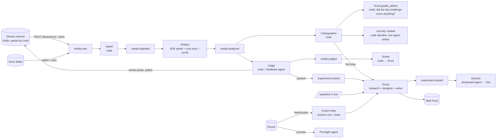
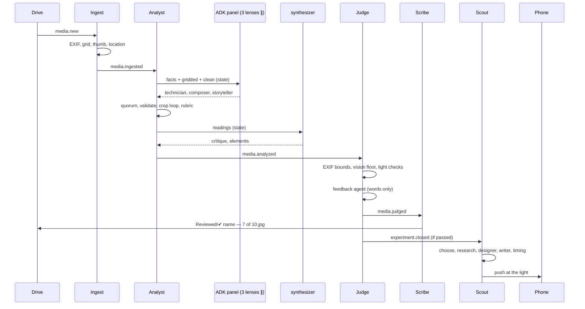

# Agents

The implemented agent architecture on Google ADK, written from the code as it is.
The code still uses the legacy `Experiment`, `Fault`, `TechniqueState`, and score schemas.
[Product decisions](product-decisions.md) define the target Experiment, Finding,
Technique Map, and Change language. [Feature list](feature-list.md) tracks the
migration. This file remains the source for the submission architecture diagram,
so the diagram must label legacy identifiers before export rather than presenting
them as finished product language.

## Principles

1. **Stages are code; agents are called inside stages.** A stage is a Python
   function on a bus topic (`ingest`, `analyst`, `cartographer`, `judge`, `scribe`,
   `scout`, `director`). It loads state, calls zero or more agents, validates what
   they return against the domain, writes state, publishes the next topic. No agent
   publishes, stores, or calls another agent by itself.
2. **An agent answers a question with a schema.** Every `LlmAgent` has an
   `output_schema` and an `output_key`; what it returns is validated twice — by
   ADK against the schema and by `domain/` against the world (taxonomy ids, cell
   refs inside the grid, points inside their own cells, bounds inside the envelope).
3. **Arithmetic before opinion, and arithmetic outranks it.** What can be computed is
   computed first (`exposure.py`, `sun.py`, `tone.py`, `motion.py`, `tendency.py`) and
   handed to the model as facts; the model is asked only what needs a reader. Where a
   measurement settles a question it does not merely inform the vote, it *wins* it:
   `panel.aggregate` takes `settled_against` as a veto and `settled_for` as a
   corroborating vote at confidence 1.0 (decision 34).
4. **Decide in code, write in the model.** Criteria checks, rankings, slots, and
   profile differences are deterministic. A model turns a decision into words or
   chooses between options code has already bounded. The deterministic legacy score
   remains implementation debt and is not a product claim.
5. **Fresh session per call.** No conversational memory between stages. Memory is
   the store (Firestore / `store.json`): Technique Evidence, constraints, analyses,
   Tendency counts, Experiment history, and Journey Updates. A retry never inherits
   half-written state.
6. **An agent may refuse, and is graded.** `panel.aggregate` returns an abstention when
   every lens saw something and no two saw the same thing, rather than averaging three
   opinions into a Verdict nobody held (decision 38). Every legacy Experiment freezes the
   Tendency it was aimed at, the current implementation of the Experiment baseline.
   `scout.grade_advice` compares counts afterward and records whether behaviour changed
   after the advice. It does not claim causation. No model adjudicates either result.

## Topology

Locally every topic is an `InProcessBus` task; on Cloud Run every topic is a
Pub/Sub push subscription to `/pubsub/<stage>` with OIDC, an ack deadline of 540 s,
five attempts, and a `<topic>.dlq`. Handlers are registered once against either bus
(`infra/bus.py`); the stage functions do not know which transport called them.
`media.analyzed` fans out to two subscriptions so Cartographer and Judge retry and
dead-letter independently.

## ADK primitives, and why each

| primitive | used for | why this and not another |
|---|---|---|
| `LlmAgent(output_schema, output_key)` | every model call that returns data | the schema is the contract; `output_key` puts the answer in session state where `run_workflow` reads it back typed |
| `ParallelAgent` | the Analyst's three lenses | three readers that differ in instruction *and* input, concurrently; 20 s wall clock instead of 60 |
| `before_model_callback` | per-lens image routing | the panel is one user turn, so without this every lens sees every image; this is the seam where readers stop sharing their eyes (decision 18) |
| `SequentialAgent` | panel → synthesizer; (planned) designer → writer | deterministic order with shared session state; the synthesizer reads `{technician}`, `{composer}`, `{storyteller}` from state via instruction templates |
| `InMemoryRunner` per call | all of the above | one runner and one session per attempt; nothing outlives the stage |
| session `state` seeding | catalogue text, facts, prior readings | `{key}` templates in instructions are filled from state, so prompts are files (`prompts/*.md`) and data is injected, never formatted into them |
| Python between agents | crop loop, quorum, envelope validation | an `LlmAgent` with `output_schema` cannot take tools, and no agent can inject a rendered image mid-invocation; the loop is a stage's Python, not a `LoopAgent` |

Not ADK, on purpose:

- **Scout research** uses the GenAI SDK with `google_search` grounding. Same
  constraint: a schema'd `LlmAgent` cannot carry tools, so research is one grounded
  call whose text and citations are handed to the schema'd writer as state.
- **The Coach** is a Gemini Live session (`gemini-live-2.5-flash-native-audio`,
  us-central1) relayed over one WebSocket per frame; the phone never holds a
  credential. Tools are `FunctionDeclaration`s answered by `services/coach.run_tool`
  inside the relay. Live is a different runtime from ADK's turn-based runner.
- **Veo** is a direct Vertex call inside the Director stage, after the storyboard
  agent.

## The agents, as they are

| agent | kind | input | returns (`output_key`) | called from | notes |
|---|---|---|---|---|---|
| `technician` | lens, `LlmAgent` | EXIF facts + exposure arithmetic + gridded frame | `TechnicianOut` (`technician`) | Analyst panel | owns exposure/lens/video families |
| `composer` | lens | gridded frame only | `ComposerOut` (`composer`): techniques, moves with `kind`, subject cells + `subject_x/y`, crop | Analyst panel | owns composition family |
| `storyteller` | lens | clean frame only | `StorytellerOut` (`storyteller`) | Analyst panel | owns light/colour/story families |
| `synthesizer` | `LlmAgent` | the three readings from state | `SynthesisOut` (`synthesis`): critique, elements | Analyst, after the panel | never sees the image |
| `scrub` | lens, video only | two exact frames pulled by ffmpeg at the Composer's timestamps | `ScrubOut` (`scrub`) | Analyst stage, after the panel | fourth vote on camera-move techniques; rates no elements |
| `crop_rater` | `LlmAgent` | original + rendered crop | `CropVerdict` (`crop`) | Analyst stage crop loop | ≤ 2 rounds; kept only if composition rose |
| `judge` (feedback) | `LlmAgent` | verdict facts from code, frame, previous best with its observations | `FeedbackOut` (`feedback`) | Judge stage, after pass/fail is decided in code | writes words; decides nothing |
| `scout` (writer) | `LlmAgent` | technique, why-now, recent critiques, research text, skills, constraints | `ExperimentOut` (`experiment`): title, brief, criteria text, references | Scout stage, after `rules.choose` and research | criteria bounds come from the taxonomy, not the model |
| `director` (storyboard) | `LlmAgent` | technique + experiment | `Storyboard` (`storyboard`): Veo prompt | Director stage | then Veo 3.1 fast, 6 s vertical with its own audio |
| `preflight` | `LlmAgent` | experiment's SEEN criteria + 640 px preview | `PreflightOut` (`preflight`): per-check ok + fix | `/drive/preflight`, synchronous, ~8 s | never guesses camera settings |
| `listener` | `LlmAgent` | Coach transcript | `NotesOut` (`notes`): missing gear, notes | after a Coach session | the post-session fallback for `remember` |
| `journey` | `LlmAgent` | only measured evidence: counts, exploration, what widened, what became repeatable, keeper lifts | `JourneyOut` (`journey`): one paragraph | Cartographer stage, only when the profile moved | sees no photograph; may not say anything it cannot point at |
| Coach | Gemini Live, tools `issue_quest`, `remember`, `skill_map` | gridded frame + Analyst read + constraints as the first turn; text and 16 kHz PCM | audio, transcript, tool calls | `/api/live/{shot_id}` | a experiment issued by voice is an ordinary experiment |

All `LlmAgent`s run `gemini-3.7-flash` on the Vertex global endpoint.

### Code between the agents, per stage

- **Analyst**: the shot is claimed as `ANALYSING` *before* the first model call, dated so a
  dead attempt cannot strand it — the stage spends four to six calls before it writes
  anything, so without the claim a redelivery re-pays for the whole panel.
  `run_workflow(analyst_agent())` with a 180 s timeout → `panel.aggregate`
  (quorum 2; a lens's own family counts alone at ≥ 0.75; confidence is the mean of
  those who agreed) → `validate` (taxonomy ids, cells in grid, subject point inside
  its cells, `MoveKind` routing: a crop asked for as a move goes to
  `suggested_crop_cells`) → crop loop → `rubric.overall` (weighted mean in code) →
  overlay render → `media.analyzed`. A panel below quorum raises; the stage retries
  and then dead-letters.
- **Judge**: EXIF bounds first (`domain/criteria`), then vision tags at the Judge's
  confidence floor; a technique with bounds cannot pass on vision alone when EXIF is
  present and fails. Only then the feedback agent. Always publishes `media.judged`
  so the Scribe runs once with the outcome.
- **Cartographer**: `skills.apply_analysis` (pure) → `scout.grade_advice` (did the last
  challenge move anything?) → `journey.maybe_write` (has the body of work moved enough to
  be worth a paragraph?). The second and third usually answer no and write nothing;
  neither can fail the map, which is already stored.
- **Scout**: skill decay → `tendency.build` over the whole corpus → `rules.choose` (gap,
  recency, missing gear, *preferring* what pushes against the narrowest dimension — the
  profile reorders the curriculum and never widens it) →
  `rules.why_now` → research (grounded) → writer → `criteria_for` from the taxonomy
  → `timing.deliver_at` (light window, sun, last location) → push on the tick.
- **Director**: storyboard agent → Veo → `experiment.reference_clip`. Veo failing
  dead-letters; the experiment simply has no clip.

## State and sessions

- ADK session state is **per call and discarded**. It carries the prompt's data
  (`{catalogue}`, `{facts}`, `{prior}`) in and the `output_key`s out; `run_workflow`
  reads them back after the run and validates each against its schema, reporting a
  missing or malformed one in `errors` so the stage can decide on quorum instead of
  failing.
- Durable state is the store: `User` (constraints, location, Drive cursor), `Shot`,
  `Analysis`, `TechniqueState`, `Experiment` (verdicts inside), `ActivityEvent`. Firestore in
  the cloud, one `store.json` locally. Every stage is idempotent on shot id or
  experiment id: a redelivery finds the status already advanced and returns.
- Secrets never enter the store or a prompt: the Drive refresh token is in Secret
  Manager (local: `.blobs/tokens`), the Live session is opened server-side.

## Failure tolerance

| layer | mechanism |
|---|---|
| model call | `with_retry`: exponential backoff with jitter, ≤ 4 retries, only on transient markers (429, 503, 500, deadline, connection); permanent markers (400, 401, 403, 404) fail at once — a 400 that mentions "internal" is still a 400 |
| workflow | per-sub-agent errors collected, not raised; quorum decides; 180 s timeout on the panel |
| stage | idempotent on id; exceptions propagate to the transport |
| transport | Pub/Sub: 5 attempts, 10 s–300 s backoff, then `<topic>.dlq`; a DLQ replay re-runs one stage, never the fan-out |
| cross-stage | the Judge publishes on every shot; the Director never blocks the experiment; the Scribe updates in place on redelivery |

## What is deliberately not an agent

Ingest (EXIF, ffprobe, grid, contact sheet), Cartographer (skill transitions),
the Judge's verdict, the Scribe, timing, the crop render, the overlay, the rubric's
weighted mean, and — from `lighting.md` / `conditions.md` — the sun, the cast, the
ratio, the edge, `derive`, `fit`, `prep`, the delta thresholds, `light.check`. Each
of these was a candidate for a model call and is a function because a function is
testable with a number and a model is not.

## Legacy lighting proposal, not current backlog

The following proposal predates the locked product and is not in the current
[feature list](feature-list.md). Do not build it before the P0 longitudinal loop.

| agent | kind | bounded by | returns | stage |
|---|---|---|---|---|
| `lighting_designer` | `LlmAgent`, first of a `SequentialAgent[designer → (code) → writer]` | the technique's recipe envelope, narrowed by the sky; the slots code offers with sun and weather; constraints; recent light facts | `LightPlanOut`: setting, source, pattern, key angles, quality, fill, modifiers, `say` | Scout |
| `brief_writer` | the existing `scout` writer, now reading `{light_plan}` from state | the completed plan | `ExperimentOut` | Scout |
| `replanner` | `LlmAgent` | the old and new `Derived`, three alternative slots with fits (a `Literal` over their ids built per call), constraints | `ReplanOut`: `keep` \| `shift(slot)` \| `swap(technique, slot)` \| `hold`, reason | the tick, only when code's delta exceeds threshold |

The designer → writer pair is the second place the panel pattern is reused: a
Python step (`light.complete`, `light.validate`) sits between two `LlmAgent`s; an
out-of-envelope answer re-runs the designer once with the violation quoted, then
falls back to the recipe default with an event. The Technician gains `LightRead` in
its schema; the Judge's feedback agent receives `light.check`'s list verbatim.

## One shot, end to end

## Models

| model | where | region |
|---|---|---|
| `gemini-3.7-flash` | every `LlmAgent`, research, pre-flight | Vertex `global` |
| `gemini-live-2.5-flash-native-audio` | Coach | us-central1 |
| `veo-3.1-fast-generate-001` | Director | us-central1 |
| Lyria 3 (clip preview) | month reel, bonus | `global` |

Every model id, cap, timeout and topic is in `config.py`; none is a literal anywhere
else (`AGENTS.md`).
