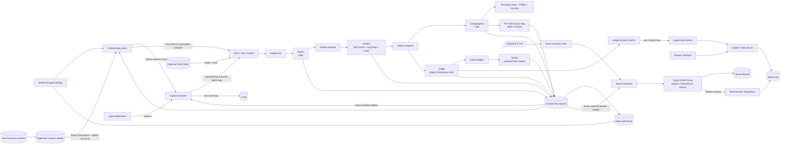
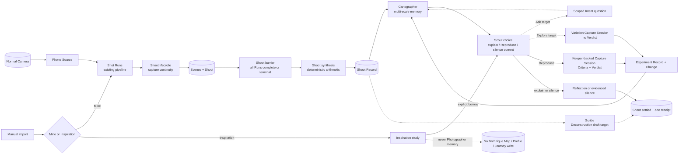
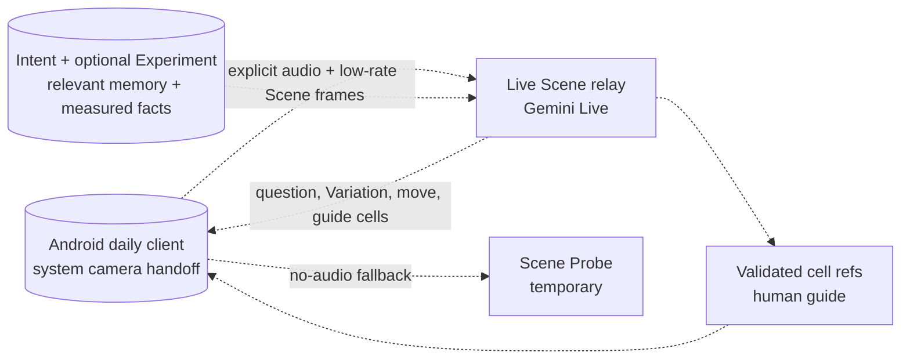

# Agents

The implemented per-Shot agent architecture on Google ADK, the current backend Shoot-level learning workflow, and the later completed memory and summoned Scene Companion. Solid arrows in the current diagram are built. Client receipt, corrected Explore, Ask, Deconstruction, and Live remain target work in the later diagrams until the [feature list](feature-list.md) marks their rows built.
The product vocabulary is locked: Experiment, Finding, Technique Map, Change. The
only migration names left are the `skills` Firestore collection key and
`TechniqueState`. Scores are not stored. [Domain model](domain-model.md)
is normative; [feature list](feature-list.md) tracks what is left. This file remains
the source for the submission architecture diagram.

## Principles

1. **Stages are code; agents are called inside stages.** A stage is a Python
   function on a bus topic (`ingest`, `analyst`, `cartographer`, `judge`, `scribe`,
   `scout`). It loads state, calls zero or more agents, validates what
   they return against the domain, writes state, publishes the next topic. No agent
   publishes, stores, or calls another agent by itself.
2. **An agent answers a question with a schema.** Every `LlmAgent` has an
   `output_schema` and an `output_key`; what it returns is validated twice — by
   ADK against the schema and by `domain/` against the world (taxonomy ids, cell
   refs inside the grid, points inside their own cells, bounds inside the envelope).
3. **Arithmetic before opinion, and arithmetic outranks it.** What can be computed is
   computed first (`exposure.py`, `sun.py`, `tone.py`, `motion.py`, `tendency.py`) and
   handed to the model as facts; the model is asked only what needs a reader. Where a
   measurement settles a question it does not merely inform the vote, it *wins* it:
   `panel.aggregate` takes `settled_against` as a veto and `settled_for` as a
   corroborating vote at confidence 1.0 (decision 34).
4. **Decide in code, write in the model.** Reproduce Criteria checks, selection bounds, slots, and
   profile differences are deterministic. A model turns a decision into words or
    chooses between options code has already bounded. No score is persisted.
5. **Fresh session per call.** No conversational memory between stages. Memory is
   the store (Firestore / `store.json`): Technique Evidence, constraints, analyses
   from which Tendency counts are recomputed, Experiment history, and Journey Updates.
   A retry never inherits half-written state.
6. **An agent may refuse, and its advice is checked.** `panel.aggregate` returns an abstention when
   every lens saw something and no two saw the same thing, rather than averaging three
   opinions into a result nobody held (decision 38). Reproduce freezes one exact Keeper
   and its Criteria before any result. Only Reproduce asks Judge for a Verdict. Baseline
   Change remains available where a Tendency actually selected an Experiment. It does
   not claim causation. No model adjudicates either result.
7. **One Shot is Evidence; one Shoot is completed learning work.** The Shot Run remains the atomic stage account. The backend now groups capture-continuous Shots into Scenes and a Shoot, waits for every member Run, synthesizes what repeated and varied, and stores Scout's warranted action or silence. Client receipt and Deconstruction remain. A Capture Session stays separate explicit Experiment membership.

## Current topology



Android now uses Credential Manager, one build-configured service origin, encrypted device sessions, Room, and WorkManager. Pairing endpoints remain only for older APKs. The configured physical-phone Reproduce acceptance and Cloud deployment have not run. Explore, Compare, and Gemini Live remain outside this release.

## Shoot-level topology and remaining routes

The current backend implements membership, the barrier, deterministic synthesis, and `explain`, Keeper-backed `reproduce`, or `silence`. Dashed product branches below remain incomplete.



`Shoot` and `Capture Session` are orthogonal. A Camera Shot may belong to both one natural Shoot and one explicit Experiment batch without a second Analysis. Inspiration may reuse imaging and visual readers, but writes a separate record.

The aggregate adds depth rather than another critic swarm. Code owns membership, barriers, deterministic figures, route eligibility, and state transitions. No model participates in current Shoot route eligibility or the deterministic Reproduce card. A bounded Shoot reader may be added only if real receipts expose a useful comparison the existing evidence cannot settle.

## Later summoned Scene Companion topology



The later path keeps the current system-camera capture, deep Analyst, and longitudinal code. Intent and the photographer own the foreground decision; an Experiment is optional context and Gemini Live is summonable.

Locally every topic is an `InProcessBus` task; on Cloud Run every topic is a
Pub/Sub push subscription to `/pubsub/<stage>` with OIDC, an ack deadline of 540 s,
five attempts, and a `<topic>.dlq`. Handlers are registered once against either bus
(`infra/bus.py`); the stage functions do not know which transport called them.
`media.analyzed` fans out to two subscriptions so Cartographer and Judge retry and
dead-letter independently.

## ADK primitives, and why each

| primitive | used for | why this and not another |
|---|---|---|
| `LlmAgent(output_schema, output_key)` | every model call that returns data | the schema is the contract; `output_key` puts the answer in session state where `run_workflow` reads it back typed |
| `ParallelAgent` | the Analyst's three lenses | three readers that differ in instruction *and* input, concurrently; 20 s wall clock instead of 60 |
| `before_model_callback` | per-lens image routing | the panel is one user turn, so without this every lens sees every image; this is the seam where readers stop sharing their eyes (decision 18) |
| `SequentialAgent` | panel → synthesizer; (planned) designer → writer | deterministic order with shared session state; the synthesizer reads `{technician}`, `{composer}`, `{storyteller}` from state via instruction templates |
| `InMemoryRunner` per call | all of the above | one runner and one session per attempt; nothing outlives the stage |
| session `state` seeding | catalogue text, facts, prior readings | `{key}` templates in instructions are filled from state, so prompts are files (`prompts/*.md`) and data is injected, never formatted into them |
| Python between agents | crop loop, quorum, envelope validation | no agent can inject a freshly rendered image mid-invocation without an untested `before_model_callback` path, and `LoopAgent` is deprecated in 2.7.1; a bounded two-round Python loop is testable with a number (decision 19) |

Not ADK, on purpose:

- **Scout research** uses the GenAI SDK with `google_search` grounding. Not because
  ADK forbids the pairing — 2.7.1 supports `output_schema` with tools — but because
  grounding metadata carries the real source URLs, and `pick_references` needs them:
  research is one grounded call whose text and citations are handed to the schema'd
  writer as state, so no reference can be a URL a model invented.
- **The current Coach** is a Gemini Live session (`gemini-live-2.5-flash-native-audio`,
  us-central1) relayed over one WebSocket per reviewed Shot. The web client never holds
  a Google model credential. Tools are `FunctionDeclaration`s answered by
  `services/coach.run_tool` inside the relay. Live is a different runtime from ADK's
  turn-based runner. The target adds a device-authenticated Live Scene Session that
  accepts microphone audio and low-rate frames before the shutter.
- **Director/Veo** remains an optional manually invoked legacy capability. It has
  no topic, subscription, automatic Scout call, or core UI surface.

## Current agents and target role changes

| agent | kind | input | returns (`output_key`) | called from | notes |
|---|---|---|---|---|---|
| `technician` | lens, `LlmAgent` | EXIF facts + exposure arithmetic + gridded frame | `TechnicianOut` (`technician`) | Analyst panel | owns exposure/lens/video families |
| `composer` | lens | gridded frame only | `ComposerOut` (`composer`): techniques, moves with `kind`, subject cells + `subject_x/y`, crop | Analyst panel | owns composition family |
| `storyteller` | lens | clean frame only | `StorytellerOut` (`storyteller`) | Analyst panel | owns light/colour/story families |
| `synthesizer` | `LlmAgent` | the three readings from state | `SynthesisOut` (`synthesis`): critique | Analyst, after the panel | never sees the image; reader rubric values stay transient |
| `scrub` | lens, video only | two exact frames pulled by ffmpeg at the Composer's timestamps | `ScrubOut` (`scrub`) | Analyst stage, after the panel | fourth vote on camera-move techniques; rates no elements |
| `crop_rater` | `LlmAgent` | original + rendered crop | `CropVerdict` (`crop`) | Analyst stage crop loop | ≤ 2 rounds; kept only if composition rose |
| `shoot_reader` (target) | bounded `LlmAgent` | code-derived Shoot figures, member thumbnails, and only the unresolved visual comparisons | typed subject-continuity and Variation observations | Analyst Shoot synthesis, after the terminal barrier | unbuilt; does not grade, rank, choose a Keeper, or repeat every Shot critique |
| `judge` (feedback) | `LlmAgent` | Verdict facts from code, result Shot, and the exact frozen Keeper reference | `FeedbackOut` (`feedback`) | explicit Reproduce result only | writes words; decides nothing |
| `shoot_scout` | code stage | settled Shoot receipt, exact Keeper Evidence, open and recent Experiments, constraints | typed `explain`, `reproduce`, or `silence` decision plus deterministic Reproduce when eligible | Shoot settlement, after the member barrier | records exact warrant ids, rejected Ask/Explore routes, versions, execution and attempt state; no model decides or writes the current route |
| `scout` (writer) | `LlmAgent` | Keeper-backed Technique, exact reference Shot id and warrant ids, recent critiques, grounded research, Technique Map, constraints | `ExperimentOut` with Reproduce Criteria | explicit, daily, Coach, and post-Experiment Scout paths | legacy/current non-Shoot entry points; code eligibility and the atomic open slot still bound it |
| `director` (optional legacy) | `LlmAgent` | Technique + Experiment | `Storyboard` (`storyboard`): Veo prompt | manual check script only | atomically discards the clip if the Experiment closed while rendering |
| `preflight` | `LlmAgent` | current: Experiment Criteria + 640 px preview; target: optional Intent and Experiment context | current `PreflightOut`; target returns one question, Variation, move, or refusal | Scene Probe fallback | temporary preview; never creates a Shot or guesses camera settings |
| `listener` | `LlmAgent` | Coach transcript | `NotesOut` (`notes`): missing gear, notes | after a Coach session | the post-session fallback for `remember` |
| `journey` | `LlmAgent` | bounded Evidence: Shoot coverage, counts, distinct Scenes, Experiment outcomes, what widened, what became recurring, positive Keeper distributions | `JourneyOut` (`journey`): one paragraph | Cartographer stage, only when the longitudinal record moved | sees no original media; may not say anything it cannot point at |
| Coach | Gemini Live, tools `issue_experiment`, `remember`, `technique_map` | current: reviewed Shot; target: current Scene frames, audio, Intent, optional Experiment, measured facts, memory | audio, transcript, tool calls | current `/api/live/{shot_id}`; target Live Scene route | target adds `show_guide` with cell refs and no shutter tool |

All `LlmAgent`s run `gemini-3.7-flash` on the Vertex global endpoint.

### Code between the agents, per stage

- **Analyst**: the shot is claimed as `ANALYSING` *before* the first model call, dated so a
  dead attempt cannot strand it — the stage spends four to six calls before it writes
  anything, so without the claim a redelivery re-pays for the whole panel.
  `run_workflow(analyst_agent())` with a 180 s timeout → `panel.aggregate`
  (quorum 2; a lens's own family counts alone at ≥ 0.75; confidence is the mean of
  those who agreed) → `validate` (taxonomy ids, cells in grid, subject point inside
  its cells, `MoveKind` routing: a crop asked for as a move goes to
  `suggested_crop_cells`) → crop loop → overlay render → `media.analyzed`. Overall
  and element scores are not stored. A panel below quorum raises; the stage retries
  and then dead-letters.
- **Judge**: only a Shot carrying an explicit open Reproduce id reaches Criteria checks.
  The Experiment already holds the exact Keeper reference. EXIF bounds come first
  (`domain/criteria`), then vision tags at the Judge's
  confidence floor; a technique with bounds cannot pass on vision alone when EXIF is
  present and fails. Missing EXIF or unresolved visual Criteria records an abstention,
  leaves the Experiment open, and creates no Verdict. Only a settled result reaches
  the feedback agent. Verdict append and completion are one transaction; Skip or
  Expire cannot overwrite the winner. The stage always publishes `media.judged` for Scribe.
- **Cartographer**: `technique_map.apply_analysis` (pure) → `scout.check_advice` (does
  comparable behaviour differ since the last Baseline, and is it comparable at all?) →
  `journey.maybe_write` (has the body of work moved enough to be worth a paragraph?).
  The second and third usually answer no and write nothing; neither can fail the map,
  which is already stored.
- **Scout**: read corroborated Technique Evidence inside marked Keepers → rank the
  supported Techniques with recency and explicit gear constraints → freeze the
  strongest exact Keeper reference → research (grounded) → writer → `criteria_for`
  from the taxonomy → atomically claim the photographer's one-open slot →
  `timing.deliver_at` → push when due. If no Keeper-backed direction survives,
  Scout records why it stayed silent. Explore and Compare wait for their real
  type-specific records.
- **Director**: optional only. A conditional storage patch attaches a generated
  clip only while the Experiment is still open; otherwise the blob is deleted.

### Target code between Shot Runs and the next intervention

- **Shoot lifecycle**: capture continuity assigns each approved Camera Shot to one
  natural Shoot and one Scene. Explicit correction may change this membership.
  Capture Session membership stays independent and never follows from time.
- **Shoot barrier**: synthesis starts only after every member Run is complete or
  terminal. A late-discovered member reopens or versions the Shoot Record
  idempotently instead of silently making its summary stale.
- **Shoot synthesis**: pure code computes counts, distributions, distinct-Scene
  coverage, Keeper signals, Experiment membership, and comparable deltas. The
  bounded `shoot_reader` receives only comparisons that those figures cannot settle.
  It may describe a difference; it may not score the Shoot or infer Intent.
- **Cartographer**: writes the multi-scale memory from Shot, Scene, Shoot, and
  Experiment Evidence. Recurrence, Reproduce attempts, Criteria outcomes,
  condition transfer, and positive Keeper counts remain separate axes.
- **Scout**: domain code determines which routes are eligible, then records one
  typed choice: explain, ask one consequential question, offer Explore, offer
  Reproduce, or stay silent. The writer receives only that route. The stored record
  includes the warrant, rejected routes, input ids, policy version, and prompt/model
  provenance.
- **Scribe**: code selects eligible one-claim layers from stored Evidence. A bounded
  writer may order and caption them; imaging renders the Deconstruction. The
  photographer chooses the Keeper cover, export, and posting.

## State and sessions

- ADK session state is **per call and discarded**. It carries the prompt's data
  (`{catalogue}`, `{facts}`, `{prior}`) in and the `output_key`s out; `run_workflow`
  reads them back after the run and validates each against its schema, reporting a
  missing or malformed one in `errors` so the stage can decide on quorum instead of
  failing.
- Durable server state currently holds `User` (constraints, location, Drive cursor),
  `Shot`, `Analysis` (model and prompt version), `TechniqueState`, `Experiment` (fixed
  Keeper, explicit result Shot ids, and Verdicts), `CaptureSession`, `Run`, device
  sessions, one-open slot, `JourneyUpdate`, and `ActivityEvent`. The target adds
  persisted `Scene`, `Shoot`, `ShootRecord`, `Inspiration`, and `Deconstruction`
  records without rewriting the current ones. Firestore is used in the cloud and one
  `store.json` locally. Android Room caches the read model and owns immutable source
  assignments; it is never a second photographic truth. Every stage is idempotent on
  its domain id.
- Secrets never enter the store or a prompt: the Drive refresh token is in Secret
  Manager (local: `.blobs/tokens`), the Live session is opened server-side.

## Failure tolerance

| layer | mechanism |
|---|---|
| model call | `with_retry`: exponential backoff with jitter, ≤ 4 retries, only on transient markers (429, 503, 500, deadline, connection); permanent markers (400, 401, 403, 404) fail at once — a 400 that mentions "internal" is still a 400 |
| workflow | per-sub-agent errors collected, not raised; quorum decides; 180 s timeout on the panel |
| stage | idempotent on id; retryable ingest leaves the Shot `new`; only proven bad media becomes `failed`; other exceptions propagate |
| transport | Pub/Sub: 5 attempts, 10 s–300 s backoff, then `<topic>.dlq`; a DLQ replay re-runs one stage, never the fan-out |
| cross-stage | Judge publishes on every Shot; Scout claims one open slot atomically; Scribe updates in place; the Run barrier prevents one fan-out branch from claiming completion; the Capture Session barrier waits for every member before one summary |
| target Shoot | a terminal barrier accounts for every member Run; synthesis is idempotent on Shoot revision; late discovery versions or reopens the record; Scout and Deconstruction failures settle as explicit outcomes rather than losing the Shoot |

## What remains deterministic code

Ingest (EXIF, ffprobe, grid, contact sheet), Cartographer transitions, the Judge's
Verdict, current Scribe rendering, timing, crop rendering, overlays, and — from
`lighting.md` / `conditions.md` — the sun, cast, ratio, edge, `derive`, `fit`,
`prep`, delta thresholds, and `light.check` remain functions because their answers
must be replayable. The target Shoot barrier, evidence arithmetic, Scout route
eligibility, and Deconstruction rendering follow the same rule. A bounded writer
may choose among code-approved candidates; it never replaces these decisions.

## Legacy lighting proposal, not current backlog

The following proposal predates the locked product and is not in the current
[feature list](feature-list.md). Do not build it before the P0 longitudinal loop.

| agent | kind | bounded by | returns | stage |
|---|---|---|---|---|
| `lighting_designer` | `LlmAgent`, first of a `SequentialAgent[designer → (code) → writer]` | the technique's recipe envelope, narrowed by the sky; the slots code offers with sun and weather; constraints; recent light facts | `LightPlanOut`: setting, source, pattern, key angles, quality, fill, modifiers, `say` | Scout |
| `brief_writer` | the existing `scout` writer, now reading `{light_plan}` from state | the completed plan | `ExperimentOut` | Scout |
| `replanner` | `LlmAgent` | the old and new `Derived`, three alternative slots with fits (a `Literal` over their ids built per call), constraints | `ReplanOut`: `keep` \| `shift(slot)` \| `swap(technique, slot)` \| `hold`, reason | the tick, only when code's delta exceeds threshold |

The designer → writer pair is the second place the panel pattern is reused: a
Python step (`light.complete`, `light.validate`) sits between two `LlmAgent`s; an
out-of-envelope answer re-runs the designer once with the violation quoted, then
falls back to the recipe default with an event. The Technician gains `LightRead` in
its schema; the Judge's feedback agent receives `light.check`'s list verbatim.

## Current Shot path

```mermaid
sequenceDiagram
  participant Camera as Normal camera
  participant Phone as Phone Source
  participant Session as Capture Session
  participant API as Direct ingress
  participant Ingest
  participant Analyst
  participant Panel as ADK panel (3 lenses ∥)
  participant Cartographer
  participant Judge
  participant Scribe
  participant Scout
  participant Run
  Phone->>Session: reserve open Reproduce
  Phone->>Camera: explicit system-camera visit
  Camera->>Phone: new approved Camera media
  Phone->>Session: commit exact ordered source manifest
  Phone->>API: stream original + stable source id + Capture Session id
  API->>Session: validate frozen membership; derive Experiment id
  API->>Run: create durable stage account
  API->>Ingest: media.new
  Ingest->>Ingest: EXIF, grid, thumb, location
  Ingest->>Run: measured, retrying, or terminal
  Ingest->>Analyst: media.ingested
  Analyst->>Panel: facts + gridded + clean (state)
  Panel-->>Analyst: technician, composer, storyteller
  Analyst->>Analyst: quorum, synthesis, validate, crop loop
  Analyst->>Run: visual reading stored
  Analyst->>Cartographer: media.analyzed fan-out
  Analyst->>Judge: media.analyzed fan-out
  Cartographer->>Cartographer: Technique Map, Profile, Journey
  Cartographer->>Run: longitudinal record checked
  Judge->>Session: each Verdict, abstention, or terminal member
  Session->>Session: judge all; any Criteria met; choose representative
  Judge->>Run: Verdict, abstention, or non-applicable
  Judge->>Scribe: media.judged
  Scribe->>Run: Drive write or recorded skip
  Judge->>Scout: experiment.closed (if Criteria met)
  Cartographer->>Scout: free-Shot record changed
  Scout->>Scout: Keeper evidence, research, writer, atomic slot, or silence
  Scout->>Run: offer or silence accounted
  Run-->>Session: every member complete or terminal
  Session-->>Phone: one FCM summary + authoritative refresh
  Run-->>Phone: latest status
  Run-->>API: complete only after every required outcome
```

## Models

| model | where | region |
|---|---|---|
| `gemini-3.7-flash` | every `LlmAgent`, research, pre-flight | Vertex `global` |
| `gemini-live-2.5-flash-native-audio` | current post-Shot Coach; target Live Scene Companion | us-central1 |
| `veo-3.1-fast-generate-001` | optional legacy Director | us-central1 |

Every model id, cap, timeout and topic is in `config.py`; none is a literal anywhere
else (`AGENTS.md`).
