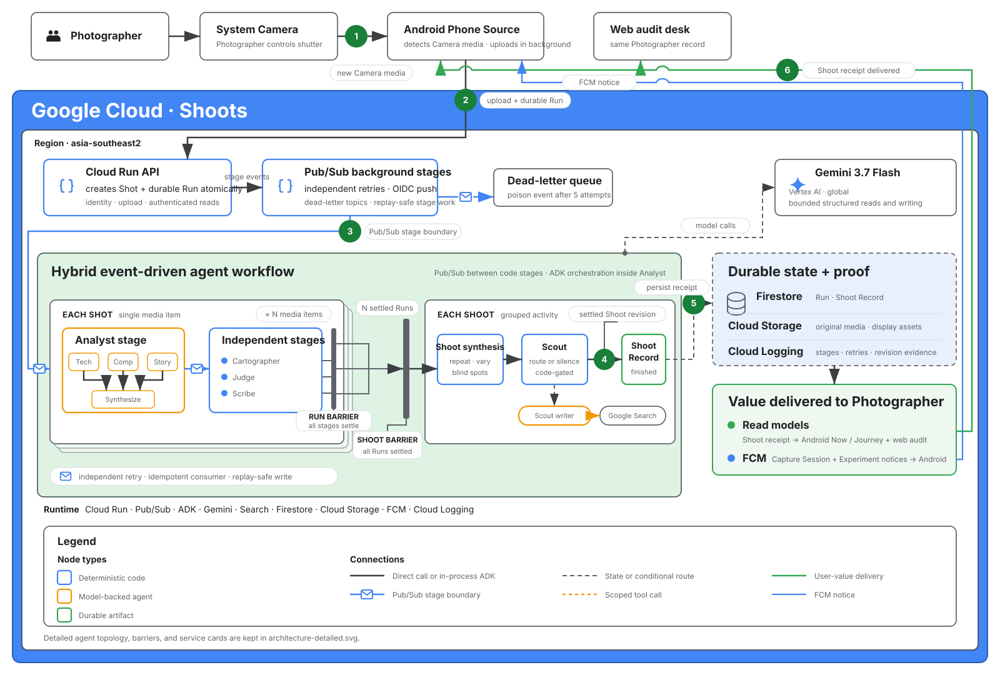

# Submission architecture

The primary diagram is the judge-facing overview. It follows one unattended path from
ordinary Camera activity to finished learning work returned to the Photographer. The
[detailed architecture](architecture-detailed.svg) retains the full agent topology,
barriers, state cards, and implementation vocabulary.

The current core path is event-driven rather than coordinator-driven:

1. the Photographer uses the system Camera and Android Phone Source;
2. the Cloud Run API creates one Shot and durable Run;
3. Pub/Sub invokes independently retryable stages;
4. the Shot and Shoot workflows settle through code-owned barriers;
5. Firestore and Cloud Storage retain the finished work;
6. read models return the Shoot receipt to Android and web, while FCM delivers Capture
   Session and Experiment notices to Android.

Inside the Analyst, an ADK `SequentialAgent` runs a `ParallelAgent` containing the
Technician, Composer, and Storyteller, followed by the Synthesizer. Crop rater and
video Scrub are conditional auxiliary reads. Code validates taxonomy ids, cells, hard
Evidence, Criteria, membership, barriers, and route eligibility. Judge's model writes
feedback only. A code-gated Scout policy chooses and executes the intervention route.
When permitted Experiment copy needs research, it invokes the Scout writer. That writer
also serves on-demand and scheduled paths; only its research call uses Google Search
grounding.

The overview shows the transport boundary rather than pretending every arrow is an
agent call. ADK orchestration stays inside the Analyst stage. Blue envelope edges cross
Pub/Sub stage boundaries. The stacked Shot lane runs once per media item; its settled
Runs fan into a gate-shaped Shoot barrier, which waits for every current member before
one Shoot revision may settle. A poison event leaves the normal path for its stage DLQ.

Blue boxes are deterministic code, amber boxes are model-backed agents, and green boxes
are durable artifacts. Black solid edges are direct or in-process ADK work. Blue edges
with envelopes are Pub/Sub stage boundaries. Dashed grey edges are state or conditional
routes, dashed amber edges are scoped tool calls, and the long green path returns value
to the Photographer.

There is no fictional root coordinator, A2A, MCP, Agent Engine, or Model Armor. Runtime
is FastAPI and stage workers on Cloud Run, Pub/Sub with dead-letter topics, Firestore,
Cloud Storage, Cloud Logging, FCM, Gemini on Vertex AI, and Google Search grounding.

The primary SVG is the 1600×1080 submission export. Detailed agent and sequence diagrams
live in [agents](agents.md); domain guarantees live in the
[domain model](domain-model.md); the design-reference research lives in
[ADK agent diagram inspiration](adk-agent-diagram-inspiration.md).
