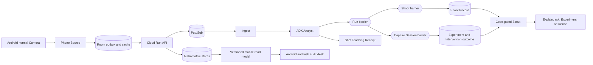

# ChatGPT repository and memory review, 2026-08-29

> Source: [Analyze Repo conversation](https://chatgpt.com/g/g-p-68979d141c808191ab308d6738886ef8/c/6a91b50c-8d48-83ec-a4a8-764bf39d3e54).
> This is a distilled review, not a new product authority. The
> [domain model](domain-model.md), [memory contract](final-memory.md), current code,
> and [release evidence](release-readiness.md) win when they disagree with the chat.

## Review lineage

The conversation contains two repository passes. The first used GitHub's public raw
source because that analysis workspace could not clone the repository. The later pass
used an uploaded source archive based on commit
`0a37f54d5451dc8c04d4d40f066ead4271873cc4` plus the local changes named in that
archive's upload notes. It could run compilation, focused pure tests, and six small
memory probes, but not the broader ADK-dependent suite because its environment lacked
the Google packages and network access.

The implementation table below was checked again against this local worktree on
2026-08-29. It distinguishes current code from the historical review snapshot.

## Executive conclusion

The strongest Shoots story is no longer "AI critiques my Shots." It is:

> Shoots keeps the learning record that phone photographers rarely keep themselves.

The full loop is:

```text
ordinary Camera use
-> durable Shot and Shoot records
-> one compact visual lesson
-> one supported Experiment, question, explanation, or silence
-> exact later results
-> a recorded outcome that may change later automatic selection
```

The visual lesson makes the evidence readable. The Taskmaster value comes from the
whole background job and its later consequence. Shoots accounts for ordinary Camera
activity, waits for the right completion boundary, chooses bounded work, tracks the
exact result set, and remembers whether repeating that intervention remains justified.

The memory design is a major differentiator:

> Every model call starts fresh. Durable, checked records are the memory.

That is more defensible than model chat history, a generated photographer profile, or
a vector database presented as truth.

## Durable product positioning

### Lead

Do not lead with "autonomous photography coach." That sounds like a single-response
critic and hides the expensive work Shoots finishes.

Lead with the missing record. A phone photographer can leave a Shoot with many Shots,
choose one Keeper, and still not know whether the decision was deliberate, recurring,
or a one-time combination of subject, timing, and light. The ignored Shots contain
useful evidence about distance, dwell, placement, variation, and repeated defaults,
but people rarely assemble that evidence themselves.

Shoots keeps that record while the photographer continues using Android's normal
Camera. It does not require a prompt for every Shot, replace the Camera, grade artistic
quality, or treat social response as proof of improvement.

### One-line description

> Shoots is a background learning agent for phone photographers. It follows approved
> Shots from Android's normal Camera, accounts for the full Shoot, builds an
> evidence-backed visual lesson, creates one justified Experiment or stays silent, and
> later checks what happened.

### Full Taskmaster claim

> Shoots turns approved Android Camera activity into a complete learning record,
> creates one evidence-backed Experiment when the record supports it, tracks the exact
> result Shots, and changes what it offers next when comparable outcomes justify that.

### Human question and measurable question

The human question is "Am I getting better, or am I getting lucky?"

Shoots cannot settle artistic improvement by itself. Its measurable question is:

> What patterns keep appearing across my Shots, and can I deliberately reproduce the
> ones present in my Keepers?

The story should connect those questions without claiming that recurrence, a Verdict,
or measured Change proves artistic improvement.

## The completed work

The product is not the generated wording. It is the stateful work and the artifacts it
leaves:

- one stable source identity and durable Run for each accepted Shot;
- capture-continuous Scene and Shoot membership;
- one revisioned Shoot Record after every current member Run settles;
- one Shot Teaching Receipt with Keep, Notice, Try, Check, and a matching visual layer;
- one typed Scout decision with exact warrants and rejected routes;
- one explicit Capture Session manifest for Experiment participation;
- one type-correct Experiment Record and later Intervention Record;
- one Journey view over recurrence, deliberate repeatability, and comparable Change;
- one evidence-bound Deconstruction draft whose cover and sharing remain Photographer
  choices.

Advice without these records is not the product.

## System design insight

### Event-driven, not a fictional root coordinator

Shoots is an event-driven workflow. Google ADK coordination lives inside the Analyst
stage. Code-owned stage transitions, barriers, and policy control the wider workflow.
The public architecture should show that truth rather than drawing a model agent above
every component.



### Three completion levels

| Level | Membership | Completion rule | Artifact |
|---|---|---|---|
| Run | One accepted Shot | Required stages are complete or terminal | Durable Shot account |
| Capture Session | Explicit ordered Experiment members | Every committed member Run has settled | Explore observation or Reproduce Criteria result |
| Shoot | Capture-continuous Camera members | Inactivity has passed and every current member Run has settled | Revisioned Shoot Record |

One Run is the shared factual base. Capture Session and Shoot remain separate because
they answer different questions and have different membership rules.

### Authority model

| Authority | Owns |
|---|---|
| Deterministic code | source ids, measurements, finite Technique catalogue, geometry validation, grouping, Capture Session membership, Criteria, comparability, barriers, retries, route eligibility, and record versions |
| Gemini agents | bounded visual interpretation, structured observations, concise wording, and feedback wording after code-owned checks |
| Photographer | Keeper, Intent, manual Mine or Inspiration role, Experiment participation, preference, whether Change feels like improvement, cover choice, and sharing |

This split keeps hallucinations from becoming state while leaving Gemini responsible
for work that needs visual interpretation.

### Reliability wording

Use:

> Replayed events use stable workflow records and do not create a second intended
> final artifact.

Do not claim universal exactly-once execution. Stable ids, durable Runs, Pub/Sub
retries, dead-letter topics, immutable Shoot Record revisions, local Room manifests,
WorkManager recovery, and scheduled stale-Run repair narrow duplicate effects. They do
not make every external call execute exactly once.

## What memory means in Shoots

Shoots does not need one generic memory table. It has several layers with different
owners and correction rules.

| Layer | Current examples | Question answered |
|---|---|---|
| Source and event memory | Shot, original media, measurements, Analysis, Run, Scene, Shoot, Shoot Record, Capture Session, ActivityEvent | What happened? |
| Photographer-owned memory | Keeper, Intent, constraint, preference, Mine or Inspiration, Scout Answer | What did the Photographer state or choose? |
| Computed pattern memory | Technique Map, Tendency Profile, comparable Change | What repeated or changed under fixed rules? |
| Action and outcome memory | Scout decision, warrants, rejected routes, Experiment outcome, Intervention Record | What did Shoots do, and what happened later? |
| Readable memory | Shot Teaching Receipt, Journey Update, Deconstruction | How can the checked record be understood? |
| Device memory | Room outbox, cached snapshot, pending client work | What must survive network loss or process death? |

Readable and device memory are not new factual authorities. The cloud records remain
the durable truth.

### What is already strong

- ADK model attempts receive fresh in-memory runners and sessions. Continuity comes
  from state assembled by code.
- Photographer Signals have stable ids, scope, source, provenance, correction,
  expiry, and bounded recall.
- User Intent can come from a consequential Scout question rather than model
  inference.
- Mine to Inspiration correction changes projection authority, not only client copy.
- Recall reports a known gap when explicit Intent is absent.
- Technique evidence axes stay separate. Recurrence, Scene coverage, explicit
  attempts, evaluable sessions, Criteria-met sessions, abstentions, and Keepers do
  not collapse into a score.
- Scout and Intervention Records preserve exact warrants, selected and rejected
  routes, result ids, comparability, outcome, and later route effect.
- Structured retrieval comes before similarity. Similarity may find candidates but
  may not decide membership, Intent, recurrence, Criteria, or Change.

## Current implementation reconciliation

The chat reviewed multiple snapshots. The following table reconciles its memory audit
against the current local worktree on 2026-08-29. Some rows include uncommitted work
and therefore are not release-candidate claims.

| Area | Current local state | Classification |
|---|---|---|
| Fresh model state | `agents/runtime.py` creates a fresh `InMemoryRunner` and session for each attempt | verified |
| Unknown recall roles | `_allowed_kinds()` raises for an unknown role | verified in current uncommitted worktree |
| Current Signal reads | superseded and expired Signals are filtered; exact scope ranks before photographer scope | verified in current uncommitted worktree |
| Purpose | stored on `MemoryRecall` and supplied by callers, but does not select a distinct policy | partial |
| Recall boundary | `photographer_memory.recall()` returns Photographer Signals only | partial |
| Scout archive access | Scout still reads open Experiment, Keeper patterns, recent Experiments, Intervention outcomes, user data, and exact Shoot Intent through separate services | open gap |
| Recall cap | first 12 matching Signals after exact-scope ranking | open gap |
| Saved recall snapshot | no Scout recall envelope id, digest, exclusions, byte count, or exact broad source list | open gap |
| Correction identity | Signal id combines fact value and provenance; supersession requires only same user and kind | open gap |
| Correction atomicity | new Signal, old Signal supersession, and ActivityEvent are separate writes | open gap |
| Scoped target validation | user existence is checked; non-photographer target ownership and existence are not uniformly resolved | open gap |
| Typed facts | Signal value remains free text; gear recognizes a small exact list | open gap |
| Legacy constraints | `User.constraints` remains a read-only fallback | migration gap |
| Strict comparability | automatic deprioritization still counts blank comparability as comparable | open gap |
| Intent routing order | Keeper-backed Reproduce is considered before exact current Shoot Intent | open gap |
| Whole projection publication | Technique Map rows do not yet use a pending generation plus atomic active pointer | scale and consistency gap |
| Dwell source | profile and Technique projections need one grouping revision and stored Scene source | consistency gap to verify before changing |

The largest gap is not missing data. It is the lack of one saved answer to:

> Exactly what memory did Scout use for this decision, what did it exclude, and why?

## Recommended recall design

Do not replace the existing records. Add one small, typed, purpose-specific package
over them.

```python
class ScoutRecallEnvelope(BaseModel):
    id: str
    user_id: str
    shoot_id: str
    shoot_revision: int
    role: str
    purpose: str

    current_record_ref: RecordRef
    keeper_refs: list[RecordRef]
    signal_refs: list[RecordRef]
    intervention_refs: list[RecordRef]
    technique_refs: list[RecordRef]
    recent_experiment_refs: list[RecordRef]
    open_experiment_ref: RecordRef | None

    eligible_routes: list[str]
    blocked_routes: dict[str, str]
    blind_spots: list[str]
    exclusions: list[RecallExclusion]

    memory_version: str
    policy_version: str
    input_digest: str
    byte_size: int
    built_at: datetime
```

The envelope should mostly hold references, versions, small policy values, omissions,
and a digest. It must not become a second factual database.

Add these references to the Scout decision:

```python
recall_id: str = ""
recall_digest: str = ""
input_signal_ids: list[str] = []
input_intervention_ids: list[str] = []
blind_spots: list[str] = []
```

The target flow is:

```text
fixed Shoot Record
-> purpose-specific recall envelope
-> deterministic route policy
-> selected and blocked routes stored
-> model call only when wording needs it
-> exact Experiment results
-> valid outcome enters a later recall envelope
```

### Recall policy

Use `(role, purpose)` as a real fail-closed policy key. Route selection, Experiment
wording, and Companion response do not need the same history.

Use a byte or token budget instead of a row count. Reserve required slots for exact
current Intent and active hard constraints. Record the final size and an overflow blind
spot.

Use explicit precedence for current use without deleting history:

```text
exact Experiment statement
over exact Shoot statement
over Photographer-wide statement
```

Different Signal kinds may need different parent chains. Source-role correction, for
example, cannot be reduced to a same-scope rule.

## Prioritized improvements

### Before submission

1. Add one typed Scout recall envelope.
2. Save its id, digest, exact source ids, size, gaps, and exclusions on the Scout
   decision.
3. Resolve exact current Shoot Intent before automatic route choice.
4. Count only explicit comparable outcomes when deprioritizing a Technique.
5. Add a visible "Why this action?" panel backed by the saved envelope.

These five items create the missing judge-visible causal chain. They do not require a
new vector store or model memory product.

### After the visible loop

- validate every scoped Signal target and user ownership;
- separate event identity from one semantic current-fact key;
- define per-kind correction policies;
- make Signal replacement or removal and its audit event all-or-nothing;
- replace free-text operational constraints with typed payloads;
- parse or confirm mixed positive and negative voice statements;
- migrate legacy `User.constraints`, then remove the fallback;
- map only confirmed typed preferences to explicit policy fields such as Experiment
  frequency, time window, Explore or Reproduce balance, notification preference, or
  ask-before-Experiment; free-text notes must not cause side effects;
- publish whole Technique Map generations behind an active build pointer;
- derive dwell from stored Scene membership and include grouping revision in its
  digest;
- keep a full rebuild path while adding digest-backed projection caching;
- split shared Scout work into clear recall, policy, Experiment creation, delivery,
  and Intervention projection seams when duplication causes drift.

## ADK memory and vector retrieval

Do not move factual Shoots memory into ADK `MemoryService`, a generated Memory Bank,
or embeddings.

Those tools may later help with low-risk conversational preferences, natural-language
search over readable notes, candidate old examples, or Inspiration discovery. Their
results must resolve back to exact Shoots records before affecting policy.

They may not become authority for:

- Shot, Scene, Shoot, or Capture Session membership;
- measured facts;
- Keeper state;
- Technique recurrence;
- Criteria or Verdict;
- result membership;
- comparability or Change.

For the submission, the missing work is a typed gateway over records that already
exist, not another storage system.

## Judge-visible memory proof

Memory needs about 35 to 45 seconds only after the recall envelope and read surface
exist. Show cause and effect, not a Firestore collection list.

### Screen 1: what Shoots knows

```text
Backlight
3 supported Shots across 2 Shoots

You said
"I was testing backlight"

You valued
Shot 14

Earlier Experiment
2 comparable unchanged outcomes

Still unknown
Whether this holds indoors
```

This separates checked Evidence, Photographer-owned meaning, positive taste, outcome
history, and a known gap.

### Screen 2: what Scout used

```text
Used for this choice
current Shoot Record
1 exact Shoot Intent
1 Keeper reference
2 comparable Experiment outcomes

Left out
unrelated Shoots
old generated critique prose
expired statements
location data not needed here
```

Show the recall digest, memory version, and policy version in small text.

### Screen 3: how memory changed the action

```text
Selected
Explore another lighting condition

Not selected
Repeat backlight again

Reason
Two comparable unchanged outcomes reduced automatic repeat advice
```

This is stronger than retrieving old text. It proves that exact earlier outcomes
changed later policy.

### Screen 4: Photographer correction

```text
Before
Tripod unavailable

Corrected
Tripod available

Later policy effect
Tripod-dependent Experiments may be considered again
```

Keep the historical decision tied to its old recall digest. The correction changes
future use without rewriting history.

### Narration

> Every agent call starts fresh. Shoots remembers through checked records: exact
> Shots and Shoots, what I said, what I marked as a Keeper, and what happened after an
> Experiment. Before Scout acts, code builds a small purpose-specific package with
> exact ids, versions, and known gaps. Earlier outcomes can change the next action,
> and I can correct my own statements without deleting their history.

## Public claim discipline

Do not say:

- "Gemini learns my style";
- "the model remembers every Shot";
- "Shoots retrains itself";
- "chat history is the memory";
- "similarity proves Intent, recurrence, Change, or improvement";
- "Shoots proves artistic improvement";
- "every event executes exactly once".

Use:

> Shoots builds each later action from versioned records with exact Evidence
> references.

Use "production-connected emulator proof passed; physical-device acceptance remains"
until the current Xiaomi path and release-signed APK have passed the release gates.

## Pitch priorities

The four-minute video should spend more time on completed action and proof than on one
Shot critique.

1. Normal Camera and automatic Phone Source detection.
2. The same Shot id crossing the local queue, Cloud Run, Run record, and client.
3. The Run and Shoot barriers accounting for all current members.
4. One compact Shot Teaching Receipt as the trust bridge.
5. One code-gated Scout choice with rejected routes.
6. One exact Capture Session and type-correct Experiment result.
7. One earlier outcome or Photographer correction changing the next action.
8. Current Cloud revision, architecture, and honest physical-device limit.

The climax is not Keep, Notice, Try, Check. It is a later action changing because the
record changed.

## Evidence and current limits from the reviewed chat

The conversation cited repository-recorded emulator, Cloud, test, latency, and corpus
results. Treat them as historical source claims until the current candidate record
matches them. The authoritative current status is [release readiness](release-readiness.md)
and [Cloud proof](cloud-proof.md).

| Source claim in the conversation | Scope and caution |
|---|---|
| 618 backend checks, 37 web checks plus production build, and 44 Android instrumentation tests with zero failures and two environment-only skips | Repository-recorded candidate evidence at the time of review, not this turn's fresh release-candidate run |
| 11 accepted real-agent cases, 180 automatic checks, zero failed checks, 12 human-review questions, and no errored cases | Labelled corpus evidence, not an outside audit or proof of long-term product value |
| mean Ingest plus Analyst time 39.8 seconds, maximum 53.6 seconds | Supports background processing; does not support real-time copy |
| Cloud Run revision `shoots-00006-mzn` at 100% traffic during the reviewed proof | Time-specific deployment state; verify immediately before submission |
| production-connected emulator covered normal Camera ingestion, approved-album learning, completed Run, visual lesson, Explore, Reproduce, one FCM summary, and recovery after network loss plus process death | Strong emulator proof; not one continuous physical Xiaomi acceptance run |
| uploaded-source memory probe run found six policy and correction gaps | Useful static and in-memory evidence; the broader ADK-dependent tests did not run in that analysis workspace |

The durable limits extracted from the review are:

- production-connected emulator coverage is not physical Xiaomi acceptance;
- a debug APK is not a release-signed APK;
- a criteria-met emulator case does not prove a criteria-met physical-device case;
- separate barrier and FCM checks do not prove all barriers plus notification in one
  continuous physical run;
- test results are repository evidence, not an independent audit;
- measured Analyst latency supports background processing, not real-time feedback;
- one small corpus cannot prove months-long usefulness or artistic development.

The next product test is longitudinal use over real Camera history. The next product
extension after the still-image loop is Compare, where the Photographer preserves two
alternatives and states a preference. Parked Live, Scene Probe, custom viewfinder,
post-Shot Coach, and video work remain outside submission copy.

## Documentation and repository follow-up

The chat identified these public-repo cleanup tasks. Recheck each against the current
tree before editing:

- keep the GitHub About text aligned with the Android Camera and Shoot Record claim;
- choose one submission-facing name. The current writing brief says `ShootsAI`, while
  the review recommends `Shoots`; this remains a user decision;
- replace stale Devpost copy that treats the visual lesson as secondary or understates
  the latest accepted proof;
- remove deployment statements that conflict with current Cloud evidence;
- provide direct Linux, macOS, and Windows setup commands;
- use replay-safe wording instead of universal exactly-once claims;
- keep candidate SHA, Cloud Run revision, Android build, tests, demo link, limits, and
  prior-work disclosure in one submission-state record.

## Prior-work disclosure draft

> Shoots was created during the hackathon submission period. Its initial scaffold
> reused general grid mathematics, imaging helpers, Google ADK runtime code, storage
> adapters, OAuth code, and a Vue shell from an earlier Visual QA project. The Shoots
> photography domain, Android Phone Source, Scene and Shoot records, Scout policy,
> Explore and Reproduce Experiment system, Intervention tracking, Shot Teaching
> Receipt, Deconstruction, recovery flow, mobile read model, and Google Cloud
> deployment were developed for this entry and are recorded in the event-period commit
> history.

Verify this wording against the exact public commit history before submission.

## Decisions still owned by Fikri

- submission-facing name: Shoots or ShootsAI;
- final lived opening for the Inspiration section;
- whether the five pre-submission memory changes fit the remaining deadline;
- which accepted Experiment result becomes the filmed memory-to-action proof;
- whether the physical-device and signing gates pass before recording.

The chat's best recommendation is therefore narrow: keep the current record model,
add one saved Scout recall package, expose one honest "Why this action?" view, and film
an earlier outcome or correction changing the next decision.
