# Implementation order

> Current execution order, 2026-08-27. Product authority lives in the
> [domain model](domain-model.md). Current feature truth lives in the
> [feature list](feature-list.md). Memory follows the
> [final memory contract](final-memory.md). The user-facing learning sequence lives in
> the [learning path](learning-path.md).

## Outcome

The deadline build must prove this complete workflow:

> Shoots notices an ordinary phone Shoot, accounts for every Shot, leaves one
> evidence-backed learning record, chooses only the help the record supports, and
> remembers whether that help changed anything.

This is the Taskmaster work. A critique, chat answer, score, or attractive screen is
not enough by itself.

## How this order was chosen

The order follows five dependencies:

1. A Shot must enter without manual upload before Shoots can remove friction.
2. Member Runs must settle before Shoots can describe a Shoot honestly.
3. Correctable Photographer memory must exist before Scout can personalize help.
4. Scout must record the offered intervention and its outcome before it can adapt.
5. The workflow must survive real model calls, Cloud execution, and phone use before
   the submission may claim it works.

Screens follow the work artifacts. They do not define them.

## Status language

- `complete`: built and accepted locally.
- `partial`: the core contract works, but named cleanup remains.
- `in progress`: implementation exists but its full repository gate or documentation
  is unfinished.
- `next`: the next unblocked work.
- `approval-gated`: requires explicit permission, credentials, or external mutation.
- `pending`: waits on earlier acceptance gates.
- `later`: useful, but outside the deadline proof.

## Critical path

```mermaid
flowchart LR
  SOURCE[Phone Source] --> RUN[Settled Shot Runs]
  RUN --> SHOOT[Revisioned Shoot Record]
  SHOOT --> MEMORY[Correctable Photographer memory]
  MEMORY --> SCOUT[Typed Scout intervention]
  SCOUT --> TEACH[Shot Teaching Receipt]
  TEACH --> QUALITY[Real-agent quality gate]
  QUALITY --> CLOUD[Cloud continuous proof]
  CLOUD --> PHONE[Physical phone acceptance]
  PHONE --> SUBMIT[Demo and submission]
```

## Ordered phases

| Order | Status | Work | Finished artifact | Acceptance boundary |
|---|---|---|---|---|
| 0 | complete | Preserve a deployable fallback and isolate new work | Protected Shoot candidate plus continuation branch | Existing per-Shot, Reproduce, Android, Drive, and cleanup paths remain recoverable |
| 1 | complete | Turn Camera activity into finished work | Revisioned Shoot Record over exact Scene and Shot membership | Every current member Run settles or ends terminally; replay and late media create no duplicate current record |
| 2 | complete | Build longitudinal evidence | Rebuildable Technique Map, Tendency Profile, Change, and Journey projections | Recurrence, distinct Shoot coverage, Reproduce outcomes, abstentions, and Keeper signals stay separate; no skill score |
| 3 | partial | Make memory honest and correctable | Mine/Inspiration authority plus scoped Photographer Signals | Inspiration cannot affect the Photographer record; facts carry source, scope, provenance, confirmation, expiry, and supersession. Legacy migration and wider Intent consumers remain later work |
| 4 | complete | Make help optional and typed | Scout decision plus Ask, Explore, Reproduce, or evidenced silence | Code determines route eligibility; Android separates “Use my Tendencies” from explicit Technique curiosity; the model cannot invent eligibility, Criteria, Technique ids, Baseline, or improvement |
| 5 | complete | Remember whether help mattered | Intervention Record from offer through observable outcome | Offered is not entered, unmet Criteria is not a bad Shot, and repeated comparable unchanged outcomes affect later automatic routing |
| 6 | complete | Leave something the Photographer can use or share | Shoot receipt, Journey comparison, and evidence-bound Deconstruction | Artifacts cite stored Evidence, label model reads, preserve uncertainty, and never auto-post |
| 7 | complete | Teach one Shot without an essay | One image-led Shot Teaching Receipt | Keep, Notice, Try, and Check agree with one visible image layer; camera or subject action outranks crop salvage; no raw cells or quality score |
| 8 | complete | Measure real agent quality | Versioned labelled corpus report from real Gemini calls | Eleven cases produced 180 automatic passes, zero failures, 12 explicit review questions, and no errors; developer review accepted each receipt against the locked hobbyist perspective |
| 9 | approval-gated | Prove the continuous workflow on Google Cloud | Exact deployed revision plus durable Run, Shoot, Scout, Experiment, and Intervention records | One phone-originated workflow completes without manual upload or hidden repair; retries remain idempotent |
| 10 | approval-gated | Prove daily phone use | Xiaomi acceptance record and signed internal APK | Background import, process death, offline cache, selected-only access, Experiment capture, revoke, and cleanup behave honestly |
| 11 | pending | Package undeniable proof | Architecture diagram, setup guide, four-minute video, screenshots, and Devpost entry | Starts after phases 9 and 10; a judge can see an unedited action, inspect the state changes, and reproduce setup |

## Phase 7: finish the Shot Teaching Receipt

This phase passed its complete local gate on 2026-08-27.

### Build

- Project stored Analysis into one deterministic read with four parts:
  `Keep`, `Notice`, `Try`, and `Check`.
- Lead `Keep` with the strongest corroborated Technique when one exists.
- Prefer a measured Finding for `Notice`; otherwise label the observation
  `model read`.
- Prefer a camera or subject Move for the next capture. Use a crop only when the
  stored advice is genuinely crop-specific.
- Name one visible condition the Photographer can check on the next Shot.
- Select one primary image layer. Other overlays remain available but silent.
- Keep the complete Analysis behind disclosure for audit.
- Use the same receipt contract on Android and web.

### Do not add

- another Gemini call;
- an overall or element score;
- a pass or fail outside Reproduce Criteria;
- generated coordinates or pixels at a model boundary;
- a fictional arrow when the stored Move does not contain drawable cells.

### Acceptance

- Real API and store integration proves projection and serialization.
- Android instrumentation proves the receipt is the first readable unit and the
  primary image layer matches it.
- Web tests prove the same information order.
- Backend Ruff, full integration suite, web tests/build, Android assemble/lint, and
  emulator instrumentation pass.

### Commit boundary

`Unify the Shot teaching receipt`

## Phase 8: real-agent quality gate

This phase decides whether Shoots teaches well enough to show. It is not a prompt
beautification exercise.

Status: complete locally on 2026-08-27. Phase 9 is the next gate and requires
explicit Cloud deployment approval.

### Corpus

Use a small labelled set that includes:

- ordinary phone Shots, not only dramatic examples;
- strong Shots where the right response may be praise or silence;
- technically weak Shots with a clear next-capture action;
- deliberate silhouettes, centre placement, high key, blur, and other cases that can
  be mistaken for Findings;
- sparse EXIF, unreadable media, and ambiguous subjects;
- several Shots from one Shoot so longitudinal claims can be checked;
- at least one Explore and one Reproduce result.

### Record

For every real run, save:

- expected supported claims and allowed abstentions;
- returned Evidence, Findings, Techniques, Move, and receipt;
- unsupported or overconfident claims;
- whether the visible annotation points to the claimed region;
- model id, prompt version, calculation version, and input digest;
- latency and terminal failure state.

### Change rule

Change a prompt, threshold, detector, or projection only when failures form a repeated
class. Do not tune the product around one impressive or embarrassing Shot.

### Acceptance

- No unknown Technique id reaches storage.
- Measured and model-read claims stay labelled correctly.
- Deliberate Intent can suppress a conflicting Finding where the product has a real
  Intent signal.
- The receipt gives a specific action only when its Evidence supports one.
- Abstention and silence remain valid outcomes.
- The saved report makes regressions visible across prompt or model versions.

### Accepted result

- 11 still-Shot cases: six ordinary phone Shots and five deliberate-control cases.
- Real `gemini-3.7-flash` calls on Vertex AI, one prompt digest across the run.
- 180 automatic checks passed, zero failed, 12 stayed explicit human-review
  questions, and no case errored.
- Developer review accepted every receipt against the locked hobbyist perspective.
- The run exposed and fixed composition-rule Findings, contradictory Moves,
  guide-only correction, stacked annotations, leaked grid grammar, and a missing
  neutral Motion blur Technique.
- Mean pipeline latency was 39.8 seconds and the slowest case was 53.6 seconds.
  This remains a product limit and is why the workflow runs in the background.

The ignored local report is private because it contains local media paths. Its
SHA-256 is `5c161d5c760345e900a3b4b8307e4b90ca771c6958d794d1adc81c2b8bb1f4e3`;
the public example manifest documents the schema without publishing the corpus.

### Commit boundary

`Add the real-agent quality gate`

## Phase 8a: close the on-demand Explore entrance

This locally complete slice closes a product gap before Cloud acceptance without
changing the learning contract.

- “Use my Tendencies” asks Scout to choose from the Photographer record and may freeze
  a comparable Baseline.
- “Choose a Technique” exposes a searchable still-Technique catalogue filtered by
  explicit missing-gear Signals.
- Observed, recurring, and new-to-record labels describe Evidence state, not ability.
- Explicit curiosity creates no invented Baseline or Change claim against unrelated
  old Shots.
- Both entrances preserve one open Experiment and explicit Capture Session membership.

Backend integration and Android emulator coverage must pass before this joins the
Cloud candidate. Physical readability remains part of phase 10.

## Phase 9: Cloud continuous proof

Do this only after explicit deployment approval.

The read-only preflight is complete. It found eight external setup inputs recorded in
[release readiness](release-readiness.md); [Cloud proof](cloud-proof.md) now owns the
approved provisioning, deployment, transport reconciliation, and readback sequence.

1. Select an exact accepted commit and rerun all local gates.
2. Deploy that exact revision to the intended Google Cloud project.
3. Verify HTTPS health, Android authentication, Firestore, blob storage, Pub/Sub or
   in-process transport as configured, and notification delivery.
4. Take ordinary Camera Shots on the phone. Do not manually upload them for the proof.
5. Observe Phone Source ingestion, one Run per Shot, Shoot grouping, terminal barrier,
   Shoot Record synthesis, projection refresh, and one Scout decision.
6. Enter one offered Experiment, settle its Capture Session, record its outcome, and
   refresh the Intervention Record.
7. Open the resulting receipt and Journey from a fresh client read.
8. Save the live revision, record ids, timestamps, and generic screenshots needed for
   the demo. Do not expose credentials or personal media.

If any stage needs hidden database repair, the continuous proof failed. Fix the
workflow and repeat it from new disposable records.

### Commit boundary

Deployment itself is not a source commit. Any fix discovered here gets a narrow,
separately accepted commit before redeployment.

## Phase 10: physical Xiaomi acceptance

After Cloud proof:

1. Sign in natively with the same Photographer identity as web.
2. Grant full Camera media access and verify one future free Shot imports
   automatically.
3. Mark a Keeper, receive a supported Experiment, and reserve a Capture Session.
4. Take several Shots in the normal Xiaomi Camera, lose network, and return.
5. Restore network and verify one immutable manifest and one result summary.
6. Kill Android while capture or upload is active and verify recovery.
7. Read the latest Shoot receipt and Journey offline.
8. Exercise selected-only media access and its manual boundary.
9. Connect and disconnect Drive only if Drive is part of the recorded demo.
10. Revoke the device and verify local and server access cleanup.

Hardware-only failures do not justify weakening the domain contract. Record the exact
device, Android version, permission state, and failing stage.

## Phase 11: submission proof

Stop product expansion.

The recording structure, proof ledger, refused claims, redaction checklist, and
runtime placeholders are prepared in [submission proof](submission-proof.md). They
remain empty until the approved Cloud and Xiaomi acceptance run supplies real ids.

The four-minute video should show this order:

1. Personal friction: "I shoot often, but I cannot tell deliberate Technique from
   luck or repetition."
2. An ordinary phone Shoot enters without manual upload.
3. The backend accounts for each member through durable Runs and settles one Shoot
   Record.
4. Android shows one learning receipt, not thirty critiques.
5. Scout chooses justified help and records why other routes were rejected.
6. The Photographer tries an Experiment.
7. Shoots records the outcome and changes later routing when the evidence warrants it.
8. The architecture view exposes the Run, Capture Session, and Shoot barriers.

Required artifacts:

- readable architecture diagram;
- reproducible backend, web, and Android setup;
- exact Google Cloud deployment evidence;
- signed internal APK;
- unedited proof-of-action segment;
- fallback recording from the protected candidate;
- final repository and link audit.

## Parallel work

These may proceed before Cloud approval, but they cannot change the core contracts:

- OAuth, Firebase, signing, and Cloud credential setup;
- architecture diagram and video outline;
- disposable labelled Shot corpus collection;
- copy and spacing polish on screens already in the proof path;
- optional Drive verification if the demo will show it.

Do not parallelize Scene/Shoot membership, Scout eligibility, memory authority, or
snapshot schema changes without first changing the domain model.

## Deliberately later

- Compare and explicit preference learning;
- a blind Shoot model reader, unless the quality report proves deterministic
  synthesis leaves a specific gap;
- summoned Gemini Live Companion and Scene Probe;
- weather, location facts, and ambient context;
- a custom camera, automatic shutter, or live preview scoring;
- embeddings or vector retrieval before structured retrieval shows a measured need;
- broad Android visual redesign unrelated to the proof path;
- public Play Store release.

These are not missing pieces of the deadline claim. Adding them now would reduce the
chance of proving the work already built.

## Commit sequence from the current branch

1. Narrow fixes found by Cloud acceptance, one failure class per commit
2. Narrow fixes found by Xiaomi acceptance, one failure class per commit
3. `Prepare the submission proof`

No commit, push, deployment, account mutation, or public submission is authorized by
this document. Each still requires the user's explicit request.
