# Implementation order

> Active execution order, 2026-08-26. Product authority lives in the
> [domain model](domain-model.md). Current state lives in the
> [feature list](feature-list.md). Memory behaviour follows the
> [memory contract](final-memory.md). The user-facing evidence sequence lives in the
> [learning path](learning-path.md).

## Outcome

The next build must make this sentence visibly true:

> Shoots turned an ordinary Camera period into one settled learning record,
> chose the kind of help the Evidence supported, and accounted for every member.

The deadline build does not attempt the complete product. It adds the smallest
missing work unit above the existing per-Shot pipeline: one revisioned Shoot Record
and one typed Scout decision shown to the Photographer.

## Protected behaviour

Do not weaken or replace these working paths:

- Phone Source observes approved Camera media and streams each original once.
- One accepted Shot owns one Run and one Analysis path.
- Capture Session alone controls explicit Experiment membership.
- Reproduce keeps its frozen Keeper reference, Criteria, batch barrier, Verdicts, and
  one summary.
- Free Shots never enter an Experiment through capture time.
- Current Android cached reads, device sessions, Drive controls, and account cleanup
  continue to work.
- The current deployable revision remains available as the fallback.

## Dependency chain

```mermaid
flowchart LR
  BASELINE[Deploy and verify fallback] --> DOMAIN[Scene, Shoot, Shoot Record contract]
  DOMAIN --> STORE[Store adapters and repository]
  STORE --> LIFE[Capture grouping and Shoot lifecycle]
  LIFE --> BARRIER[Shoot terminal barrier and revision]
  BARRIER --> SYNTH[Deterministic Shoot synthesis]
  SYNTH --> SCOUT[Typed Scout route and warrant]
  SCOUT --> SNAP[Mobile snapshot and cached DTO]
  SNAP --> NOW[Now Shoot receipt]
  NOW --> ACCEPT[Integration and device acceptance]
  ACCEPT --> CANDIDATE[Candidate Cloud deployment]
  CANDIDATE --> DEMO[Four-minute proof and submission]
```



Do not start a downstream phase because its screen is easy. Each phase needs the
previous phase's real artifact.

## Backlog mapping

| Gate | Primary feature rows |
|---|---|
| 0 | P0.14 Cloud deployment |
| 1 and 2 | P0.30 Scene/Shoot lifecycle, P0.31 terminal workflow |
| 3 | P0.32 Shoot synthesis |
| 4 | P0.34 typed Scout choice |
| 5 | P0.22 cached native reads, P0.24 decision-led mobile IA |
| 6 and 7 | P0.10, P0.17, P0.19 physical and cloud acceptance |
| 8 | P0.15 architecture artifact, P0.16 continuous demo |

P0.4 corrected Explore, P0.33 Mine/Inspiration, and scoped Photographer memory were
built on the candidate-protected continuation after the Shoot slice. P0.35
Deconstruction is next because it presents the completed learning work without changing
its Evidence.

## Work isolation

The current checkout contains unrelated work. Preserve it.

1. Review and commit only the agreed product and memory documentation.
2. Record the known-good fallback SHA.
3. Create a clean deployment worktree from that SHA.
4. Create a separate `codex/shoot-record` worktree for the Shoot slice.
5. Never deploy from the dirty shared checkout.
6. Keep commits small enough to revert one phase without removing earlier phases.

No commit, branch, worktree, push, or deployment happens without the corresponding
user request. This section defines the later execution, not present authorization.

## Gate 0: establish the fallback

Timebox: four hours before new feature work, unless another task handles it in
parallel.

After explicit deployment approval:

1. Run the current backend, frontend, and Android build gates from the clean fallback
   SHA.
2. Deploy that exact SHA to Google Cloud.
3. Verify the public health endpoint and deployed revision.
4. Verify web authentication.
5. Send one disposable Shot through the deployed pipeline.
6. Confirm its Run settles and its ActivityEvents appear.
7. Record the Cloud Run revision and keep it available for rollback and the fallback
   demo.

If infrastructure fails, classify and fix that path first. Cloud proof is an entry
requirement. Do not hide a broken deployment behind more local features.

Gate passes when the existing product has one verified cloud execution from an exact
SHA.

## Gate 1: Scene and Shoot domain

Target time: hours 0 through 6 of the Shoot branch.

### Build

- Add `Scene`, `Shoot`, `ShootStatus`, `ShootRecord`, and the stored typed Scout
  decision to `backend/app/domain/entities.py` with empty or compatible defaults for
  older records.
- Add pure grouping and revision rules in `backend/app/domain/shoots.py`.
- Reuse `SCENE_GAP` for the first Scene grouping rule.
- Add one configurable Shoot inactivity gap, longer than `SCENE_GAP`.
- Treat an undated Shot as its own Scene. Never guess it into a neighbouring event.
- Keep Capture Session membership outside these types except for Shot references.

### Memory module interface

The Shoot implementation sits behind a small interface in
`backend/app/services/shoots.py`:

```text
observe_shot(ctx, shot_id) -> Shoot membership result
close_inactive(ctx, at) -> changed Shoot ids
on_run_settled(ctx, shot_id) -> pending | settled Shoot Record
latest_record(ctx, user_id) -> Shoot Record | none
```

Grouping, revisions, barrier checks, provenance, and ActivityEvents stay inside this
module. Callers should not reproduce those rules.

### Verify

Write integration coverage using real `InMemoryStore` and repository functions:

- ordered and out-of-order Shot arrival;
- two Scenes inside one Shoot;
- a gap that creates a second Shoot;
- duplicate Shot observation;
- an undated Shot;
- Photographer isolation.

Gate passes when grouping is deterministic and replay-safe without changing existing
Shot, Run, or Capture Session behaviour.

### Commit boundary

`Add Scene and Shoot domain records`

## Gate 2: storage, lifecycle, and terminal barrier

Target time: hours 6 through 16.

### Build

- Extend the Store contract through repository methods for Scene, Shoot, and Shoot
  Record reads and atomic mutations.
- Implement the same behaviour in `InMemoryStore`, `FileStore`, and `FirestoreStore`.
- Assign Phone Source Shots after their authoritative capture instant is available.
- Add a scheduled close-inactive path for cloud and in-process execution.
- Invoke the Shoot check from Run settlement beside the existing Capture Session
  check.
- Wait only for the current Shoot revision's member Runs.
- Write exactly one completion ActivityEvent per Shoot revision.

### Barrier interaction

- One Shot still has one Run.
- Capture Session keeps its immutable committed members.
- Shoot keeps capture-continuous members for one revision.
- A delayed committed Capture Session member may create a newer Shoot revision.
- Neither aggregate waits for the other aggregate.
- One Run settlement may trigger both idempotent checks.

### Late media

When a late Camera Shot belongs inside a settled Shoot:

1. increment the Shoot revision;
2. preserve the earlier Shoot Record;
3. point `current_record_revision` at the pending revision;
4. wait for the affected Run;
5. settle exactly one newer Shoot Record;
6. make current reads resolve the newer record.

### Verify

Integration coverage must include:

- every member completed;
- one terminally unreadable member;
- one member still retrying;
- replayed Run settlement;
- late free Shot;
- delayed committed Capture Session member;
- Capture Session settlement before and after Shoot settlement;
- no duplicate Run, Analysis, Shoot Record, or ActivityEvent.

Gate passes when the three barriers settle independently over one shared Run truth.

### Commit boundary

`Add revisioned Shoot settlement`

## Gate 3: deterministic Shoot synthesis

Target time: hours 16 through 24.

### Build

- Build the current Shoot Profile over the exact member ids using existing
  `profile.build_for_shots` and Tendency arithmetic.
- Record Scene count, Shots per Scene, unreadable coverage, orientation, placement,
  framing, light, palette, and corroborated Technique figures where supported.
- Label model-read dimensions as model reads.
- Preserve blind spots instead of filling empty values.
- Produce a short code-authored receipt from those figures.
- Attach exact Shot ids, Scene ids, calculation version, Analysis digests, and Shoot
  revision.

Do not add the bounded Shoot reader in this phase. First test whether existing
measurements and Analyses already produce a useful record.

### Receipt shape

The first receipt answers only:

- how many Shots and Scenes were accounted for;
- what repeated;
- what varied;
- what could not be read;
- which evidence is measured, model-read, or Photographer-owned.

It does not choose the best Shot, infer Intent, grade the Shoot, or claim improvement.

### Verify

- exact frozen member set;
- mixed readable and unreadable members;
- no overall score;
- sparse dimensions omitted or marked blind;
- changed Analysis digest changes record provenance;
- identical input produces identical deterministic fields.

Gate passes when a user can understand one Shoot without opening every Shot.

### Commit boundary

`Synthesize settled Shoot records`

## Gate 4: typed Scout decision and intervention memory

Target time: hours 24 through 32.

### Build

- Add the route enum `explain`, `ask`, `explore`, `reproduce`, and `silence`.
- Code computes route eligibility before any writer call.
- The protected candidate first exposed `explain`, `reproduce`, and `silence`; the
  continuation now also exposes corrected `explore` after its record and UI landed.
- Record exact warrant references, rejected routes, projection versions, policy
  version, and writer provenance where used.
- Reuse the current Keeper-backed Reproduce selection and one-open Experiment claim.
- Let `explain` point to the deterministic Shoot receipt. It needs no new model call.
- Store `silence` with its reason.
- Start intervention state as `not_applicable`, `offered`, or `entered` where the
  current system can prove it. Do not infer failure from no attempt.

`ask` remains unavailable until its real record and UI exist. Corrected Explore now
owns Variations, Capture Sessions, and observations; it is no longer a rejected alias
for Reproduce.

### Ordering inside one Shoot

1. member Runs settle;
2. deterministic synthesis completes;
3. current longitudinal projections refresh;
4. code selects Scout route;
5. optional Scout writer runs inside that route;
6. the immutable Shoot Record revision settles with the Scout decision.

### Verify

- no Keeper-backed direction produces explain or evidenced silence;
- supported Keeper Evidence may offer Reproduce;
- an existing open Experiment blocks another offer;
- unavailable ask records why it was rejected, while Explore requires a supported
  Tendency Direction or explicit supported Technique;
- replay produces no second Experiment or Scout decision;
- model output cannot change route eligibility.

Gate passes when the stored route is inspectable and changes what the system does.

### Commit boundary

`Store typed Scout decisions`

## Gate 5: mobile read model and one focal receipt

Target time: hours 32 through 40.

### Backend

- Extend `/api/mobile/snapshot` with the active or latest Shoot and newest Shoot
  Record.
- Include revision, state, member coverage, receipt fields, Scout route, and exact
  navigation ids.
- Include the new fields in ETag calculation.
- Keep existing fields compatible with older Android clients.

### Android

- Add serializable Shoot and Shoot Record DTOs.
- Reuse the existing cached snapshot resource. Do not add a Room table unless the
  read requirements prove it is necessary.
- Make Now choose one focal state in this order:
  1. active Capture Session requiring action;
  2. Shoot still processing;
  3. newest settled Shoot receipt;
  4. Camera action before any Shoot exists.
- Move per-Shot detail behind Shots. Do not let it compete with the Shoot receipt.
- Show last-synced time when the receipt comes from cache.

The first version needs no separate Shoot screen. One expandable Now receipt may link
to the existing Shots and Journey destinations.

### Verify

- snapshot compatibility and ETag change;
- processing to settled transition;
- latest revision replaces a superseded receipt;
- cached offline receipt;
- active Capture Session still outranks passive reflection;
- 390 px Android layout and selectable semantics.

Gate passes when a Photographer sees the completed work without reading pipeline
state or thirty critiques.

### Commit boundary

`Show the latest Shoot receipt`

## Gate 6: 48-hour acceptance checkpoint

Target time: hours 40 through 48.

Run one integration scenario through the local backend and Android emulator:

1. Import Camera Shots across at least two capture-continuous Scenes.
2. Let all member Runs complete or become terminal.
3. Confirm one current Shoot Record and one receipt.
4. Confirm its repeated and varied decisions cite exact members.
5. Confirm Scout stores one eligible route and rejected alternatives.
6. Deliver one late Camera Shot and confirm exactly one newer revision.
7. Include one Shot that belongs to a frozen Capture Session.
8. Restart the client and read the same receipt offline.

Run the repository gates in proportion to the changes:

- backend Ruff;
- backend integration suite with real stores;
- frontend production build if shared schemas changed;
- Android assemble and lint;
- Android instrumentation for cached receipt and navigation.

### Keep decision

Keep the Shoot slice only if all are true:

- terminal behaviour is idempotent;
- existing Reproduce remains intact;
- the receipt is useful without debug explanation;
- Android shows the newest revision correctly;
- no critical or runtime error remains;
- the exact branch SHA can be deployed.

If any condition remains false at hour 48, stop. Preserve the branch, return to the
deployed per-Shot fallback, and finish the submission around that honest workflow.

### Checkpoint result — 2026-08-27

**Keep the Shoot slice.** Local evidence now satisfies the checkpoint:

- one real integration scenario forms two Scenes, waits for completed and terminal
  Runs, includes a Shot shared with a frozen Capture Session, stores the deterministic
  receipt and typed Scout decision, creates one Keeper-backed Reproduce, accepts late
  free media as revision 2, preserves revision 1, and serves revision 2 through the
  ETag mobile snapshot;
- backend Ruff and the complete integration suite pass;
- Android assemble and lint pass;
- all emulator instrumentation passes with the hardware-only local-backend test
  skipped in the ordinary run;
- the local-backend test separately passes through real WorkManager, adb reverse,
  bearer authentication, HTTP snapshot retrieval, and Room persistence;
- cached Shoot receipt data survives a Room database close/reopen without network;
- Now focal-order tests pass at the normal emulator size and at an exact approximately
  390 dp width.

The first local-backend run exposed a test-harness defect: it waited for WorkManager's
enqueue transaction and then asserted the job had already finished. Device logs showed
the worker starting after that immediate assertion. The harness now waits for a real
terminal `WorkInfo` state, and the authenticated backend request is observed.

This is a local keep decision, not a Cloud or physical-device claim. Gate 7 remains
blocked on explicit deployment approval and configured credentials.

## Gate 7: candidate deployment and physical proof

Only after Gate 6 and explicit deployment approval:

1. Merge or select the exact accepted commits into a clean candidate branch.
2. Run the full local gates again.
3. Deploy the exact candidate SHA.
4. Verify Cloud Run revision, public health, authentication, Firestore writes,
   Pub/Sub retries, and the Shot, Capture Session, and Shoot barriers.
5. Configure Android to the HTTPS origin and run the physical Xiaomi path.
6. Confirm automatic Camera ingestion, offline cached receipt, Reproduce, Drive where
   configured, device revocation, and cleanup paths.
7. Keep the earlier baseline revision available until the submission is finished.

Do not call a push a deployment. Record the live revision and the exact workflow it
completed.

## Gate 8: submission proof

Stop feature work. Use the remaining time for:

- one readable architecture diagram showing Run, Capture Session, and Shoot barriers;
- reproducible setup for web, backend, and Android;
- one unedited live execution with visible Cloud state changes;
- a four-minute video that leads with the personal friction and finished Shoot Record;
- Devpost fields, repository cleanup, screenshots, signed internal APK, and final
  link checks;
- one fallback recording using the stable per-Shot Reproduce deployment.

The judge should be able to repeat:

> It watched an ordinary phone Shoot, accounted for every Shot, produced one learning
> record, chose justified help, and preserved proof of what it did.

## Commit sequence

Use these boundaries unless a verified dependency requires a smaller commit:

1. `Document the Shoot memory contract`
2. `Add Scene and Shoot domain records`
3. `Add revisioned Shoot settlement`
4. `Synthesize settled Shoot records`
5. `Store typed Scout decisions`
6. `Show the latest Shoot receipt`
7. `Prove the Shoot workflow`
8. `Prepare the submission artifacts`

Each commit keeps existing tests and build gates green. Do not mix Drive work, visual
polish, or unrelated documentation into these commits.

## Candidate-protected continuation

The accepted Shoot candidate remains untouched on `codex/shoot-record`. Further
product work runs on an isolated continuation branch and may replace the candidate
only after its own complete acceptance. This changes sequencing, not deployment
authority: no branch is pushed or deployed without explicit approval.

| Order | Status | Work | Finished artifact | Acceptance boundary |
|---|---|---|---|---|
| 1 | complete | Full Technique Map axes and invalidation | Rebuildable per-Technique projection with independent recurrence, Scene/Shoot coverage, Reproduce, Criteria, abstention, and Keeper facts | Corrections retract unsupported current claims; Android shows facts separately; no score |
| 2 | partial | Photographer correction and Mine/Inspiration authority | Superseding source-role and grouping records plus deterministic invalidation | Free manual correction is built; Inspiration cannot write Photographer memory; grouping and Experiment-cited correction remain |
| 3 | partial | Scoped Photographer memory and Listener migration | Provenance-carrying Intent, constraint, preference, and source-role records behind one signal seam | Signal/recall/correction and Listener migration are built; native Intent authoring and legacy migration remain |
| 4 | complete | Corrected Explore | Open Explore Experiment with explicit Variations, immutable per-session choice, ordered results, and structured observations | The Photographer may try alternatives freely; no Criteria, Verdict, or pass/fail language |
| 5 | next | Deconstruction | Image-led draft from a settled Shoot or Experiment Record | Every page cites stored Evidence; Photographer selects the cover; no invented score or automatic post |
| 6 | queued | Full local acceptance | One continuous emulator/backend workflow covering correction, recall, Explore, and Deconstruction | Backend, web schema if affected, Android build/lint, and full instrumentation all pass |
| 7 | approval-gated | Cloud and physical acceptance | Exact deployed revision and Xiaomi evidence | Requires explicit deployment approval and production credentials |

The dependency order matters. Correction follows the rebuildable projection so a
Mine-to-Inspiration change can actually retract claims. Explore follows scoped memory
so its Direction cannot borrow inferred Intent. Deconstruction follows settled Shoot
and Experiment Records so it presents completed work instead of generating a new
critique.

Still deliberately later:

- evidence-first Shot Move and visible-check refinement;
- a blind Shoot reader, only if deterministic synthesis leaves measured gaps;
- Compare and explicit preference memory;
- a summoned Live Scene Companion;
- broad Android visual redesign;
- weather or location context;
- embeddings, only after structured retrieval shows a measured need;
- Gemini Live or a custom camera.

## Parallel work that does not block the slice

These lanes may proceed separately if they preserve the same baseline SHA:

- optional Drive Picker and reviewed-output acceptance;
- Cloud credentials, Firebase, and signing setup;
- architecture-diagram export;
- submission copy and video outline;
- collection of a small disposable Camera corpus for the acceptance run.

They may not change Scene/Shoot membership, Scout rules, or the mobile snapshot shape
without coordinating through this implementation order.
