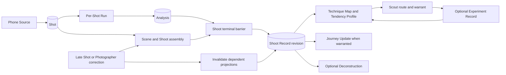

# Suggested memory architecture

> Reference only. This proposal is preserved as one side of the memory design
> comparison. The accepted result is the active
> [Shoots memory contract](final-memory.md).
> It intentionally retains rejected proposals for comparison, including blanket
> confirmation before memory writes and the incorrect Room-encryption claim.

## Position

Shoots memory should be an evidence ledger plus rebuildable projections and bounded
agent views. It should not be chat history, a personality profile, or a vector
database presented as understanding.

The memory system must answer one product question:

> Which photographic decisions am I making repeatedly, which can I now make on
> purpose, and how is that changing across my Shoots?

That question cannot be answered from one Shot or one generated summary. It needs
exact media history, natural Shoot episodes, explicit Photographer signals,
Experiment outcomes, comparability rules, and provenance.

## Comparison frame

The two documents have different jobs:

- [memory.md](memory.md) describes the current repository and its already proposed
  Shoot-level extension.
- This document proposes the memory contract I would implement, including write
  authority, correction, retrieval, invalidation, and the minimum delivery slice.

Compare them on these questions:

| Question | What a strong answer must specify |
|---|---|
| What is truth? | Which records are authoritative and which are derived. |
| Who may write? | Code, model, and Photographer authority at every boundary. |
| How is memory corrected? | Re-analysis, late media, regrouping, changed Intent, and deletion. |
| What does each agent see? | Typed, bounded views rather than unrestricted archive access. |
| How does advice improve? | Attempt and outcome memory without self-awarded artistic success. |
| How is comparison honest? | Exact sets, versions, blind spots, and invalidation. |
| How does it scale? | Projections and retrieval without dropping historical truth. |
| What ships first? | The smallest memory layer that closes the Taskmaster workflow. |

## Invariants

1. **The store remembers; model sessions do not.** Every model call starts without
   conversational state. Code constructs its input from durable records.
2. **Photographer authority is never inferred.** Keeper, Intent, Mine versus
   Inspiration, preference, and whether Change feels like improvement come only from
   explicit Photographer actions.
3. **Measured, model-read, and Photographer-owned claims never merge.** Storing a
   model observation does not promote it to fact.
4. **Derived memory is rebuildable.** Technique Map, Tendency Profile, Change, and
   Journey must be reproducible or traceable from authoritative records.
5. **A proxy reaches only its supported scope.** Memory must retain the signal and
   rule behind a claim, not only its prose.
6. **Scene and Shoot membership come from capture continuity or correction.** Image
   similarity may help inspection but cannot invent event membership.
7. **Shoot and Capture Session membership are orthogonal.** Natural Camera activity
   and explicit Experiment participation answer different questions.
8. **No absence becomes a negative preference.** An unmarked Shot remains unknown.
9. **No factual forgetting by timer.** A Technique that recurred did recur. Recency
   may affect Scout selection, never rewrite history.
10. **Every intervention leaves an outcome.** Explain, ask, Explore, Reproduce, and
    silence are stored with their warrant; no attempt is distinct from an unchanged
    result.

## Memory layers

| Layer | Authoritative contents | Writer | Derived or mutable? |
|---|---|---|---|
| Source | Original Shot reference, bytes, capture facts, source authority | Phone Source or ingress code | Immutable except deletion |
| Shot Evidence | Analysis, EXIF, Tone, Motion, Evidence, Findings, model and prompt versions | Ingest and Analyst | Versioned; an older read remains traceable |
| Episode | Scene and Shoot membership, exact ordered members, grouping revision | Capture-continuity code or explicit Photographer correction | Correctable through a new revision |
| Photographer signal | Keeper, scoped Intent, Mine/Inspiration, constraints, optional preference | Photographer | Supersedable; never silently inferred |
| Experiment | Capture Session manifest, Baseline, Variations or Criteria, result Shots, abstentions, Verdicts, Change | Domain services, Judge, Photographer signals | Type-specific and auditable |
| Longitudinal projection | Technique Map and Tendency Profile | Cartographer and pure domain code | Rebuildable cache |
| Intervention | Scout route, warrant, rejected routes, delivery, attempt state, later outcome | Domain policy, then bounded writer | Append or supersede; never erase the original decision |
| Presentation | Journey Update and Deconstruction | Journey writer and Scribe inside code bounds | Disposable and regenerable from cited inputs |
| Audit | Run and ActivityEvent | Every stage | Append-only explanation, not primary truth |

The raw archive is not itself a useful memory. The useful unit is a traceable
projection whose claims still point back to exact authoritative records.

## Proposed record shape

These are implementation sketches, not new product vocabulary.

### Scene

```text
id, user_id, shoot_id, revision
ordered_shot_ids
started_at, ended_at
grouping_source: capture_continuity | photographer_correction
grouping_version
```

Visual similarity is excluded from `grouping_source`. It may produce a correction
suggestion, never an automatic event claim.

### Shoot

```text
id, user_id, device_id
state: open | closing | settled
revision
ordered_scene_ids, ordered_shot_ids
started_at, last_capture_at, closed_at
grouping_version
```

The suggested states are not yet locked domain states. `closing` means capture
inactivity has ended membership discovery but member Runs are not all terminal.

### Shoot Record

```text
shoot_id, user_id, revision
scene_ids, shot_ids
run_coverage: complete | terminal | retrying per member
decision_distributions
observed_variations
technique_evidence
keeper_shot_ids
scout: route, warrant, rejected_routes, input_ids, policy_version
deconstruction: not_applicable | drafted | failed
provenance
settled_at
```

The Shoot Record is immutable per revision. A late Shot or Photographer correction
creates a newer revision and invalidates dependent projections. It does not silently
edit the Evidence behind an existing Journey Update.

### Technique Map entry

Keep the three evidence states: `unobserved`, `observed`, and `recurring`. Add
separate figures rather than a score:

```text
technique_id, status
sightings, corroborated_shots
distinct_scenes, distinct_shoots
reproduce_attempts, criteria_met_results, abstentions
positive_keeper_shots
observed_conditions
last_observed
projection_version, input_digest
```

The counts are projections. Analyses, Scene/Shoot membership, Keeper marks, and
Experiment Records remain the authority. Exact claim snapshots retain the specific
Shot and Scene ids they used.

### Scoped Photographer memory

Do not continue growing `User.constraints.notes` as an unstructured fact bag. A
remembered fact should carry:

```text
user_id
scope: photographer | shoot | scene | shot | experiment
scope_id
kind: intent | constraint | preference | source_role
value
source: photographer_action | confirmed_companion_suggestion
created_at, confirmed_at, superseded_at, optional_expires_at
```

A transcript parser may suggest a fact. Only an explicit remember action or
confirmation commits it as Photographer memory. Model inference alone stays a
labelled observation.

## Write authority

| Component | May write | Must not write |
|---|---|---|
| Phone Source / ingress | Shot source and exact assignment | Technique, Intent, Keeper, or Experiment membership inferred from time |
| Ingest | Measured media facts | Artistic interpretation |
| Analyst | Versioned model reads and bounded Evidence | Technique Map state, preference, or Scene membership |
| Episode assembler | Capture-continuity Scene/Shoot membership | Visual-similarity event claims or Experiment membership |
| Cartographer | Rebuildable Technique Map and Tendency Profile | Raw Evidence or artistic quality |
| Scout policy | Eligible route, warrant, rejected routes | Evidence, Keeper, preference, or self-awarded success |
| Scout writer | Copy inside the selected route | Route eligibility or Criteria after a result exists |
| Judge | Reproduce Verdict from frozen Criteria | Explore/Compare Verdict or quality judgment |
| Journey writer | Language from precomputed Change | New facts, causation, or improvement |
| Scribe | Deconstruction draft from eligible claims | Keeper cover selection or social publication |
| Photographer | Keeper, Intent, source role, correction, preference | Nothing; this is the highest authority for their own meaning |

## Bounded recall

Agents should never query the archive directly. Services build typed views with an
explicit token and evidence budget.

### Analyst Shot view

- one Shot;
- the measurements assigned to that lens;
- no Photographer identity hypothesis;
- no previous critique that could anchor the reading.

### Shoot reader view

- one settled Shoot revision;
- ordered contact sheets and compact member Analyses;
- code-computed distributions and unresolved comparisons;
- no Tendency Profile on the first pass.

The first Shoot read should be blind to longitudinal identity. Code compares its
structured result with earlier memory afterward. This reduces confirmation bias:
the reader cannot keep seeing the Tendency it was told to expect.

### Scout view

- latest settled Shoot Record;
- only relevant Technique Map entries and Tendencies;
- exact supporting Keeper references;
- recent Experiment outcomes, including no attempt and abstention;
- current scoped Intent and constraints;
- blind spots and code-computed eligible routes.

It should not receive the entire archive or a prose biography. Domain code selects
the route before the writer sees the brief.

### Journey view

- only already-computed comparable Change;
- separate evidence axes;
- exact provenance and known blind spots;
- prior Journey wording only to avoid repetition.

### Companion view

- current Scene frames while explicitly summoned;
- current scoped Intent and selected Experiment;
- a very small relevant memory slice;
- no raw archive browsing and no hidden location history.

## Retrieval strategy

Use structured retrieval first:

1. filter by Photographer and source authority;
2. select exact Shot, Scene, Shoot, Technique, Experiment, Keeper, and time scopes;
3. require compatible calculation and Analysis versions;
4. rank by task relevance, then recency;
5. return exact references and blind spots with the values.

Do not add a vector database for the first release. Image embeddings may later find
candidate visual analogues or Inspiration, but they may not:

- assign Scene or Shoot membership;
- count Technique recurrence;
- infer Intent or preference;
- decide Criteria;
- measure Change or improvement.

Similarity is retrieval help, not longitudinal truth.

## Update lifecycle



One normal lifecycle:

1. Phone Source creates one Shot idempotently.
2. The existing Run records every per-Shot stage.
3. Capture continuity assigns the Shot to one Scene and Shoot revision.
4. Inactivity moves the Shoot to closing; synthesis waits for every member Run.
5. Pure code computes distributions. A bounded Shoot reader resolves only visual
   comparisons that arithmetic cannot settle.
6. One Shoot Record revision settles.
7. Cartographer rebuilds or refreshes affected longitudinal projections.
8. Scout stores one eligible route and warrant, including silence.
9. Scribe attempts the Deconstruction; its outcome settles visibly.
10. A later Experiment result updates its Experiment Record and only then informs
    later Scout choices and Journey.

## Correction and invalidation

Memory that cannot be corrected will eventually become confidently wrong.

- **Late Camera media:** if its capture fact falls inside a settled Shoot, create a
  newer Shoot revision, rerun the barrier, and supersede dependent projections.
- **Scene regrouping:** preserve the earlier grouping revision and record the explicit
  correction. Recompute distinct-Scene figures.
- **Mine changed to Inspiration:** remove the item from Photographer-derived
  projections and rebuild affected claims. Never merely hide it in the UI.
- **Keeper removed:** return it to unknown and recompute only taste-linked figures.
- **Intent corrected:** supersede the scoped Intent; never rewrite the historical
  model observation as though it knew the new Intent.
- **Analysis rerun:** retain model/prompt provenance. Incompatible Journey or Change
  comparisons re-baseline rather than reporting Photographer Change.
- **Account deletion:** remove source media, authoritative records, projections,
  cached agent views, device state, and external access through one idempotent cleanup
  workflow. User-owned Drive files remain.

For the first release, rebuilding affected projections is safer than implementing
incremental subtraction. Optimise only after measured archive cost requires it.

## Intervention memory

This is the main missing agentic layer. Every Scout decision should retain:

```text
route: explain | ask | explore | reproduce | silence
warrant: exact Evidence references and thresholds
rejected_routes: route plus reason
input_ids and projection versions
policy, model, and prompt versions
delivered_at
attempt_state: not_offered | offered | entered | left | completed
observable_outcome: unchanged | changed | insufficient_evidence | not_applicable
```

The outcome evaluates the intervention, not artistic quality. Important distinctions:

- offered but never entered is not failed advice;
- entered with unreadable results is not unchanged behaviour;
- Criteria not met is not a bad Shot;
- one unchanged attempt cannot retire an approach;
- repeated comparable outcomes may change timing, framing, or route while preserving
  earlier records.

## Privacy and trust

- Every record and query is scoped by Photographer id.
- Inspiration lives outside Photographer-derived projections.
- Raw Live audio and Scene frames are discarded after the summoned session.
- Location is an explicit Shot fact or saved note, never a movement trail.
- Android Room is an encrypted cache and outbox, not a second truth.
- Revocation clears local credentials and cache without deleting the Photographer.
- Models receive thumbnails or bounded media only when their task needs pixels.
- Generated summaries cannot become retrieval facts unless their underlying structured
  claims remain attached.

## Minimum implementation slice

Build this before embeddings, richer identity, or Gemini Live:

1. Persist Scene and Shoot membership using capture continuity.
2. Add a terminal Shoot barrier above existing Runs.
3. Store one immutable Shoot Record per revision.
4. Compute deterministic Scene/Shoot distributions from existing Analyses.
5. Expand the Technique Map projection with distinct Scene/Shoot, Experiment, and
   positive Keeper figures while preserving separate axes.
6. Build a typed Scout view and store route, warrant, rejected routes, and outcome.
7. Enforce Mine versus Inspiration before manual-import longitudinal writes.
8. Surface the newest Shoot Record and evidence references in Android Journey.

The Deconstruction can follow immediately because it reads the same settled record.

## Integration acceptance

1. Thirty Camera Shots across three capture-continuous Scenes become one Shoot and
   one terminal Shoot Record without manual upload or tagging.
2. Repeating a Technique across Scenes moves recurrence figures but does not claim
   deliberate control without an explicit Reproduce attempt.
3. A Reproduce batch updates attempt and Criteria figures; unrelated free Shots do
   not enter the Experiment Record.
4. A manual Inspiration import can be analysed but changes no Photographer Technique,
   Tendency, Keeper, Change, or Journey record.
5. A prompt-version change invalidates incompatible model-read comparison instead of
   producing false Change.
6. A late Camera item creates a newer Shoot Record revision idempotently.
7. Correcting Scene membership recomputes distinct-Scene claims while retaining the
   earlier provenance.
8. Scout distinguishes offered, entered, left, completed, unchanged, and insufficient
   Evidence.
9. Every agent view excludes records outside its Photographer and declared scope.
10. Deleting a disposable account removes authoritative memory, projections, caches,
    and access idempotently.

## Decisions still required

- Exact capture-continuity thresholds for Scene and Shoot boundaries.
- Whether a settled Shoot automatically reopens for late media or creates only a new
  immutable revision while remaining visibly settled.
- The Photographer correction UI for Scene grouping and Mine/Inspiration.
- Which condition dimensions are reliable enough to count without model inference.
- Whether Companion-suggested facts require immediate confirmation or an explicit
  `remember` action.
- The archive size at which per-Shoot projection folding replaces complete rebuilds.
- Whether embeddings add enough retrieval value to justify their privacy, cost, and
  versioning burden after structured memory ships.

## Recommendation

Adopt the evidence hierarchy, bounded views, correction/invalidation rules, and
intervention memory. Keep the current principle that the store—not the agent
session—owns continuity. Do not introduce embeddings until the structured Shoot
memory answers the product question end to end.
