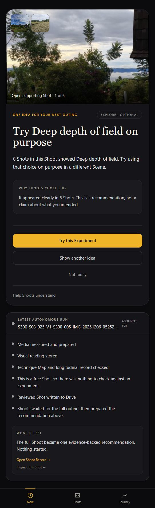
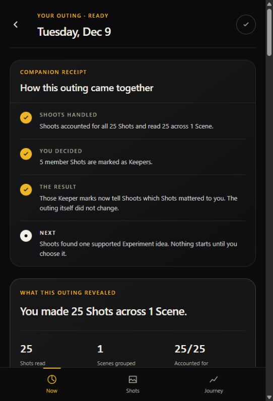
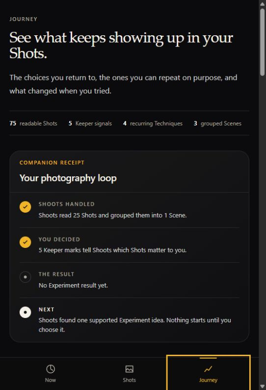

# Shoots flow deep research

Audience: Shoots product, demo, and submission work  
Date: 2026-08-30  
Status: canonical research synthesis  
Question: What does the current Shoots journey communicate to a hobbyist Photographer, a Taskmaster judge, and the official hackathon brief?

## Main verdict

Shoots has a Taskmaster-worthy engine and the wrong front door.

The real chore is substantial: observe approved Camera media, preserve stable identity, ingest every Shot, run multiple readers, recover delayed work, reconstruct Scenes and a Shoot, account for every member, update the Photographer record, write reviewed output, and leave one durable Shoot Record. That is much stronger than an AI critique or chatbot.

The current first screen does not lead with that result. It leads with another Experiment idea. The terminal receipt sits below it. A hobbyist can reasonably think, “Shoots gave me homework,” while a judge can reasonably think, “This is a recommendation app.” Both impressions hide the strongest part of the system.

Three issues create most of the damage:

1. the 30-minute inactivity gap is both a grouping rule and a result-release gate;
2. the recommendation appears before the completed Shoot Record;
3. a disclosed workflow stress corpus is presented in the product like natural personal history.

The target should be:

> normal Camera use → visible background accounting → early Shoot Record → optional personal Experiment → explicit result → later memory effect

The Shoot Record proves Taskmaster completion. The Experiment loop proves optional Photographer benefit. They should support each other, not compete for the first screen.

## Research boundary

This audit combines four evidence types:

- the current domain and source code;
- a read-only walk through the signed-in local web experience at a 390 px phone viewport;
- the existing production scale and reliability audit;
- official rules plus human-AI, workflow, streaming, agent-evaluation, and photography research.

No hobbyist Photographer was interviewed in this research pass. Statements under “likely user reaction” are informed hypotheses for testing, not reported user quotes. The judge score is also an analyst estimate, not an official score.

Cost is outside this audit.

## The current flow

```text
Camera or Drive
  → one stable Shot and durable Run per accepted file
  → Ingest, Analyst, Cartographer, Judge when applicable, Scribe
  → group Shots by capture continuity
  → wait for 30 minutes of Camera inactivity
  → wait for every member Run to complete or become terminal
  → settle one immutable Shoot Record revision
  → prepare one Scout Recommendation
  → optionally create an Experiment only after acceptance
  → optionally record a later Verdict and Change
```

The core terminal artifact is correct: one settled Shoot Record at the current revision. The sequencing around it is not.

### What works

- Approved Camera media can enter without asking the Photographer to tag or sort every Shot.
- Stable source identity and idempotent stages prevent simple retry duplication.
- Run state, ActivityEvents, terminal media outcomes, scheduled repair, and immutable Shoot Record revisions make the workflow auditable.
- The record can show exact coverage, Scene count, supported patterns, variations, limitations, and member Shots.
- The recommendation is optional and image-led. “Try this Experiment,” “Show another idea,” and “Not today” preserve creative authority.
- A late Camera Shot can create a newer Shoot revision without rewriting the earlier record.

### What the user sees now



The Now screen first says “One idea for your next outing” and gives a large “Try this Experiment” action. Only below that does it say the full Shoot became a recommendation and link to the Shoot Record. This order comes directly from `NowPage.vue`, where a Scout Recommendation wins before the completed-record state.

The recommendation card is visually strong. Its position is the problem. It turns a finished background job into the setup for another task.



The Shoot Record is the clearest Taskmaster surface. It says all 25 Shots were accounted for, shows 25/25 coverage, names the Scene count, and separates what Shoots handled from what the Photographer decided. This is what Now should reveal first.



Journey has a useful “Shoots handled / You decided / Result / Next” frame. It also mixes several levels at once: 75 archive Shots, the latest 25-Shot Shoot, five Keeper signals, four recurring Techniques, three grouped Scenes, one recommendation, and no Experiment result. A new user must reconstruct the hierarchy instead of receiving one clear story.

Additional evidence:

- [Shots archive](../../evidence/shoots-flow-deep-research-2026-08-30/04-shots-archive.png)
- [Shot detail](../../evidence/shoots-flow-deep-research-2026-08-30/05-shot-detail.png)

Shot detail currently puts a long Companion receipt before the main visual explanation. The visual Evidence is also heavily masked. The user’s Shot should be the first object; provenance and process can follow through progressive disclosure.

## What a hobbyist Photographer may think

These are hypotheses to validate with real users.

| Moment | Likely positive reading | Likely doubt |
|---|---|---|
| First result | “It found something in my own work.” | “Why is it immediately asking me to do another exercise?” |
| Background processing | “I do not have to review every Shot myself.” | “Is it still working, stuck, or waiting for me?” |
| Shoot Record | “It handled the whole outing and kept the evidence.” | “What is the one useful thing I should take away?” |
| Recommendation | “The idea is personal and optional.” | “Did ‘Not today’ teach it anything, or will it ask again?” |
| Journey | “I can see patterns across time.” | “Are these archive totals, this Shoot, or an Experiment?” |
| Shot detail | “I can inspect why it said this.” | “Why is the system story above my image?” |
| Stress corpus | “There are enough Shots to show scale.” | “Were these really 75 separate Shots and three real outings?” |

The strongest user promise is not “Shoots teaches photography.” That remains unproved. The defensible promise is:

> Shoots does the review and accounting you avoid, then gives you one evidence-backed thing worth noticing. You decide whether to act on it.

This fits research on post-capture “photowork.” A CHI field study described reviewing, downloading, organizing, editing, sorting, and filing as real work around digital photography. It also found that people often dealt with recent images and used simple time-and-event organization. Shoots is solving a credible chore when it automates that work, not when it merely adds more critique text. [Understanding Photowork](https://www.microsoft.com/en-us/research/wp-content/uploads/2006/04/paper_chi06_photowork.pdf)

Google PAIR warns that mismatched mental models can cause frustration and abandonment. It recommends explaining the benefit before the technology, setting limits early, and introducing a feature when it becomes relevant. Shoots currently demonstrates its optional next feature before establishing the completed core benefit. [Google PAIR: Mental Models](https://pair.withgoogle.com/guidebook-v2/chapter/mental-models/)

## What a Taskmaster judge may think

### What the judge is likely to value

- This is a real multi-stage background workflow, not a chat response.
- It crosses systems: Camera or Drive, Gemini processing, durable state, reviewed output, and a visible record.
- It preserves state, retries, terminal failures, provenance, and immutable revisions.
- It has meaningful human-authority boundaries. The Photographer owns the shutter, taste, Intent, Keeper signals, and Experiment participation.
- It can show exact membership and a terminal artifact rather than only fluent prose.

### Questions the current journey invites

1. Where is the uninterrupted proof from one normal Camera item to its Shot, Run, Shoot revision, Shoot Record, and external write?
2. If the agent completed the chore, why does the first screen ask the user to start another one?
3. Why must the result wait 30 minutes after all known work is already complete?
4. What does the user receive if they never mark a Keeper or accept an Experiment?
5. Does “Not today” change later recommendations?
6. Are the 75 displayed Shots genuine independent captures, deterministic stress variations, or both?
7. Can the judge see retries, terminal outcomes, and stable IDs without reading the repository?
8. Does the live product show the same flow as the narrated demo?

These questions matter because the official rules ask whether Taskmaster “intercept[s] and complete[s] a multi-step background workflow without human intervention.” The rules also require visible proof of action through a live execution, logs, database updates, or UI changes. [Official rules](https://allthingsagentichackathon.devpost.com/rules)

### Analyst rubric estimate

If the current local journey were the judged experience, a conservative estimate is:

| Official criterion | Weight | Estimate | Reason |
|---|---:|---:|---|
| Innovation and operational utility | 40% | 3/5 | The chore is real, but the first screen looks like advice and the settlement delay adds friction. |
| Architectural discipline | 30% | 4/5 | Durable Runs, state, retries, revisions, agent boundaries, and provenance are strong. |
| Demo and production readiness | 30% | 2/5 | No current single-chain Camera-to-record proof, weak long-wait status, and undisclosed corpus construction in the UI create doubt. |
| Weighted estimate | 100% | 3.0/5 | Analyst estimate only. |

This is not a claim that the project would receive that score. A tight narrated demo may hide some friction; direct judge testing may expose more. The important point is the shape of the score: architecture is ahead of visible utility and proof.

## What the hackathon brief says about the process

The official overview describes agents that work while the user does something else, remove everyday friction, and complete multi-step tasks on their own. Taskmaster specifically asks for a complete workflow that takes action, handles details, sends information to the right places, and proves the heavy lifting. The judging weights are 40% utility, 30% architecture, and 30% demo readiness. [Official hackathon overview](https://allthingsagentichackathon.devpost.com/)

Shoots fits that brief when the chore is stated as:

> After normal Camera use, reconcile every approved unseen Shot into a trustworthy Shoot Record without requiring the Photographer to upload, tag, sort, inspect, retry, or organize the batch.

Shoots fits poorly when it is stated as:

> An AI photography coach that critiques Shots and suggests an Experiment.

The second description makes the system sound conversational and advice-led. It also makes the optional Photographer choice look like unfinished work. The first description exposes the operational transformation and leaves creative coaching as additional benefit.

### Brief compliance today

| Requirement | Current truth | Verdict |
|---|---|---|
| Beyond chat | The system processes media, writes records, updates state, and performs external writes. | Strong |
| Messy multi-step chore | It reconciles many Shots and failure states into a Shoot Record. | Strong |
| Background execution | Work can continue after the client leaves. | Strong internally |
| Little or no hand-holding | Shoot settlement does not require a Keeper or Experiment. | Strong in domain, weak in first-screen communication |
| Sends information to the right places | Evidence, records, reviewed output, and longitudinal state are separated. | Strong |
| Proof of heavy lifting | Record and production metrics exist, but one live stable-ID chain is missing. | Partial |
| Real-world friction removed | Sorting and review work are removed, but 30-minute release and opaque import progress add friction. | Partial |
| Honest production demo | Stress data is disclosed in the audit, not in the product surface. | Weak |

## The 30-minute problem

### Verified cause

The code uses `shoot_gap_minutes = 30` to choose Shoot membership. The same value is also used by `close_inactive()` before an open Shoot may move to closing. `on_run_settled()` returns immediately while the Shoot is still open. The scheduled tick is configured every five minutes.

The honest default user delay is therefore up to roughly 30 minutes plus the next scheduler tick before aggregate settlement starts, even if every known Shot Run finished much earlier.

The current UI copy confirms this coupling: “Shoots waited for the full outing, then prepared the recommendation above.”

### Why that is not justified by expert evidence

Thirty minutes is a familiar web-session convention, but session thresholds are domain-specific. Microsoft researchers called inactivity thresholds historically arbitrary and found that a roughly two-minute cut-off fit intelligent-assistant interaction data better than the traditional 30-minute web-search threshold. That does not prove two minutes is right for photography. It proves that “30 minutes is conventional” is not enough. [Identifying User Sessions in Interactions with Intelligent Assistants](https://www.microsoft.com/en-us/research/publication/identifying-user-sessions-interactions-intelligent-assistants/)

Google Cloud Dataflow separates two ideas that Shoots currently couples:

- a session window groups events using a gap duration;
- a trigger decides when to emit a result;

Dataflow also supports late data after an earlier result. This is the right architectural analogy for Shoots. Capture time can decide Shoot membership while a different trigger decides when the Photographer receives useful output. [Google Cloud Dataflow: streaming pipelines](https://docs.cloud.google.com/dataflow/docs/concepts/streaming-pipelines)

### Correct architecture: process now, revise later

1. Keep a capture-time gap for deciding whether a new Shot belongs to the same Shoot or a new one.
2. Stop using that full gap as the first-result timer.
3. Add an explicit bounded source manifest for a Drive selection or Android discovery pass.
4. When every known member Run in that manifest is complete or terminal, settle Shoot Record revision 1.
5. If another capture-continuous Shot arrives later, use the existing late-Shot rule to create revision 2.
6. Tell the user the record may update if more Camera Shots arrive.
7. If a source cannot provide a bounded manifest, use a short, tested processing debounce rather than an inherited 30-minute constant. Do not present an adjacent study’s two-minute finding as the product answer.

This proposal introduces a new free-shooting batch boundary. The domain model does not currently name it. Per project rules, define that behavior in `docs/domain-model.md` before implementation.

## Long work must feel autonomous, not missing

The production audit measured roughly 97 to 119 seconds for 25-Shot Drive imports, averaging 104.353 seconds. During that period the UI showed “Opening Drive…” without a count, stage, percentage, or ETA.

NN/g recommends visible completed and remaining work for waits over 10 seconds, a current step where useful, background continuation, and a salient completion summary with links to created records and errors. [Designing for Long Waits and Interruptions](https://www.nngroup.com/articles/designing-for-waits-and-interruptions/)

Shoots already stores enough state to show a simple truthful tracker:

```text
25 Shots found
18 read · 5 waiting · 2 retrying
You can leave. Shoots will put the finished Shoot here.
```

After completion:

```text
Your Shoot is ready
25/25 accounted for · 1 Scene · 2 retries recovered
Finished 9:56 PM · 1m 47s
[Open the Shoot Record]
```

Do not expose every agent name as the main progress model. Translate technical stages into user outcomes and leave the full ActivityEvent audit underneath.

## Feedback must have a visible effect

Google PAIR recommends saying how and when feedback changes the experience. It specifically warns that a “show more/less” control that does not change later recommendations creates mismatched expectations. [Google PAIR: Feedback and Control](https://pair.withgoogle.com/guidebook-v2/chapter/feedback-controls/)

Current behavior records “Not today” as a left Intervention. Later ranking uses recent Experiments and Techniques deprioritized after repeated unchanged outcomes, but it does not use a left Recommendation as a cooldown. The user-facing control is honest about not guessing why, yet its practical future effect is unclear.

Required behavior:

- “Not today” hides this recommendation now and suppresses the same Recommendation for a disclosed period or until new supporting Evidence appears.
- “Show another idea” should either remain explicitly temporary or persist the chosen alternative. Current rotation is local only.
- “I was just shooting” should state its exact scope and later effect.
- Every Keeper receipt should say what it enables and what it does not change.

## Photography guidance should stay focused

A Stanford CHI study found that a full complex composition grid could overwhelm less-experienced photographers, while a context-adaptive subset helped them discover compositions. Participants also needed controls to slow or disable guidance. This supports Shoots showing one grounded visual idea and making it easy to disregard. It does not prove that Shoots improves photography over time. [Adaptive Photographic Composition Guidance](https://hci.stanford.edu/publications/paper.php?id=380)

The current recommendation follows this principle better than the long Shot-detail receipt. Preserve the image-led card and one idea. Move it below the finished result and keep deeper Evidence inspectable.

## Honest data is part of the product

The production audit correctly discloses that the 75-Shot gate came from 67 visually reviewed source Shots plus deterministic stress variations. The 75 files are not 75 independently captured originals. The current archive and Journey present them as 75 made Shots across dated Camera periods without a visible stress-corpus notice.

This does not invalidate the reliability test. It invalidates treating that account as evidence of natural Photographer behavior.

For judging:

- keep the stress account, but label it “Workflow stress corpus” on every relevant screen;
- state how many independent source Shots and deterministic variations it contains;
- never use it to support a Tendency, Change, personal learning, or “three real outings” claim;
- use a second account containing one intact, unmodified, normal-Camera sequence for the user story;
- connect that account to the live stable-ID proof.

Google PAIR’s mental-model guidance is directly relevant: hiding system limits and data construction creates confusion and broken trust. [Google PAIR: Mental Models](https://pair.withgoogle.com/guidebook-v2/chapter/mental-models/)

## The target journey

### 1. Arrive

First-time value statement:

> Keep using your Camera. Shoots reviews the outing, accounts for every Shot, and leaves one useful record. Nothing starts without you.

One setup action is acceptable: enable the Phone Source or select a Drive batch. Do not explain the whole learning system before the user receives value.

### 2. Shoot normally

The system Camera owns capture. The Photographer does not tag Intent, Keeper, or Experiment state unless they choose to.

### 3. See work begin

Show Shots found, read, waiting, retrying, and terminally unreadable. Let the user leave.

### 4. Receive the completed benefit first

Now should lead with:

```text
YOUR SHOOT IS READY

25 Shots handled
25/25 accounted for · 1 Scene

Shoots noticed one clear choice:
Deep depth appeared in 6 Shots across this outing.

[See what Shoots found]
```

If retries or unreadable members exist, say so here. Do not hide them in an agent log.

### 5. Offer one optional next idea

Place the existing image-led recommendation after the completed result:

```text
One optional idea for next time
Try deep depth on purpose in a different Scene.

[Try this Experiment] [Another idea] [Not today]
```

The user must be able to stop after step 4 and still feel the app finished something valuable.

### 6. Start only after acceptance

Accepting the recommendation creates the Experiment. A later explicit Capture Session associates exact result Shots. Free Camera Shots remain free.

### 7. Return an honest result

Reproduce returns Criteria met, Not yet, or Inconclusive against frozen Criteria. Explore records what appeared without a Verdict. Neither is a quality grade.

### 8. Show memory only when it changes behavior

Journey should answer four questions in order:

1. What did Shoots handle?
2. What did it notice?
3. What did I choose?
4. What happened later, and what will Shoots do differently?

Archive totals, latest Shoot facts, and Experiment facts should be visually separate.

## Priority decisions

| Priority | Decision | Why |
|---|---|---|
| P0 | Make the completed Shoot Record the first Now state. | This is the Taskmaster terminal and immediate user benefit. |
| P0 | Label the stress corpus and use a genuine Camera account for the story. | Prevents a direct trust failure. |
| P0 | Separate Shoot membership gap from result emission. | Removes an unnecessary 30 to 35 minute wait. |
| P0 | Show truthful batch progress and a salient completion receipt. | Makes long work feel autonomous and reliable. |
| P0 | Produce one live stable-ID chain from Camera source to Shoot Record and external write. | Satisfies proof of action. |
| P1 | Give “Not today” and other feedback a disclosed downstream effect. | Closes the user-control loop. |
| P1 | Simplify Journey into archive, latest Shoot, and optional Experiment layers. | Reduces hierarchy reconstruction. |
| P1 | Put the Shot and one useful visual relationship before process receipts. | Restores image-first value. |
| P2 | Run a small multi-session Photographer study. | Required before claiming learning benefit. |

## Experiments that answer the remaining uncertainty

### Five-second first-glance test

Show the current Now screen and the proposed “Your Shoot is ready” screen to five target hobbyists, in counterbalanced order. After five seconds ask:

1. What did Shoots do?
2. Is anything required from you now?
3. What useful result did you receive?
4. What would you tap next?

Gate: at least four of five identify the completed background chore and know the Experiment is optional without explanation.

### One-outing field test

Use one intact Camera sequence per participant. Measure:

- setup taps;
- time from last source upload to first useful record;
- ability to leave and return;
- whether the user can trace the main Finding to supporting Shots;
- whether the recommendation is useful, obvious, wrong, or unwanted;
- whether “Not today” behaves as expected;
- whether they choose to use Shoots for another outing.

Five participants are enough for failure discovery and a product gate, not a general claim.

### Judge rehearsal

Give a fresh evaluator the official brief and four minutes. Do not coach them inside the product. Record:

- when they first name the chore;
- when they first see proof of completion;
- whether they can follow one stable ID chain;
- whether they distinguish the stress account from the real account;
- every question, hesitation, timeout, and dead end.

### Agent quality proof

Google ADK recommends evaluating both the agent trajectory and its final result, with explicit success criteria and critical tasks. Shoots should do the same: verify the required stage and tool path, then independently verify the Shoot Record’s coverage, grounding, and usefulness. [Google ADK evaluation guidance](https://github.com/google/adk-docs/blob/main/docs/evaluate/index.md)

## Reconciled principles

### Automation versus creative control

Automate clerical and evidentiary work. Keep taste, Intent, the shutter, and Experiment participation with the Photographer. This is not missing automation; it is the correct authority boundary.

### Background work versus visible status

The user should be able to leave. That makes the completion receipt more important, not less. Background must not mean invisible.

### Session grouping versus timely value

The inactivity gap may remain useful for membership. It should not determine when the first useful result is emitted. Early result plus late revision is the cleaner model.

### Rich Evidence versus overload

Keep all Evidence and provenance, but reveal one useful conclusion first. The audit desk can expose the full trace after the benefit is clear.

### Scale proof versus personal proof

A deterministic stress corpus proves throughput and recovery. An intact personal Camera sequence proves the user story. Neither should impersonate the other.

## Final answer

Shoots should not be pitched or designed first as a photography coach.

It should be experienced first as an autonomous post-capture worker:

> I kept shooting. Shoots handled the mess, showed exactly what it finished, and left one useful, inspectable result. Then it offered one optional thing I could try.

That journey is clearer for the hobbyist, stronger under the Taskmaster rubric, and more honest about what the current system proves.

The engine is close. The next work is not more agent intelligence. It is result-first sequencing, faster honest settlement, visible progress, feedback consequences, and one genuine end-to-end proof.

## Sources

- [All Things Agentic Hackathon overview](https://allthingsagentichackathon.devpost.com/)
- [Official rules and judging details](https://allthingsagentichackathon.devpost.com/rules)
- [Google PAIR: Mental Models](https://pair.withgoogle.com/guidebook-v2/chapter/mental-models/)
- [Google PAIR: Feedback and Control](https://pair.withgoogle.com/guidebook-v2/chapter/feedback-controls/)
- [Microsoft: Guidelines for Human-AI Interaction](https://www.microsoft.com/en-us/research/publication/guidelines-for-human-ai-interaction/)
- [Microsoft HAX Toolkit](https://www.microsoft.com/en-us/haxtoolkit/ai-guidelines/)
- [NN/g: Designing for Long Waits and Interruptions](https://www.nngroup.com/articles/designing-for-waits-and-interruptions/)
- [Google Cloud Dataflow: Streaming Pipelines](https://docs.cloud.google.com/dataflow/docs/concepts/streaming-pipelines)
- [Microsoft Research: Identifying User Sessions in Interactions with Intelligent Assistants](https://www.microsoft.com/en-us/research/publication/identifying-user-sessions-interactions-intelligent-assistants/)
- [Stanford HCI: Adaptive Photographic Composition Guidance](https://hci.stanford.edu/publications/paper.php?id=380)
- [Understanding Photowork](https://www.microsoft.com/en-us/research/wp-content/uploads/2006/04/paper_chi06_photowork.pdf)
- [Google ADK: Agent Evaluation](https://github.com/google/adk-docs/blob/main/docs/evaluate/index.md)

